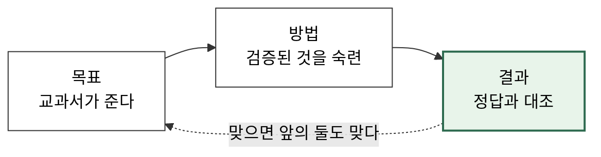
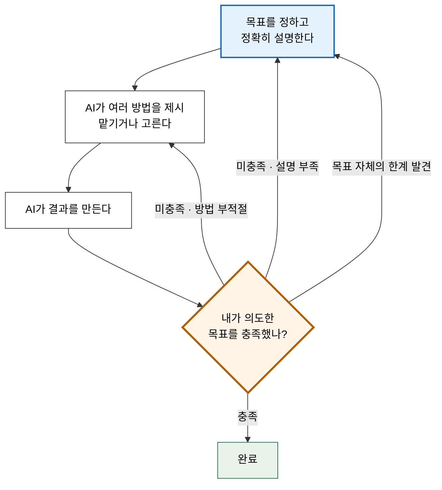
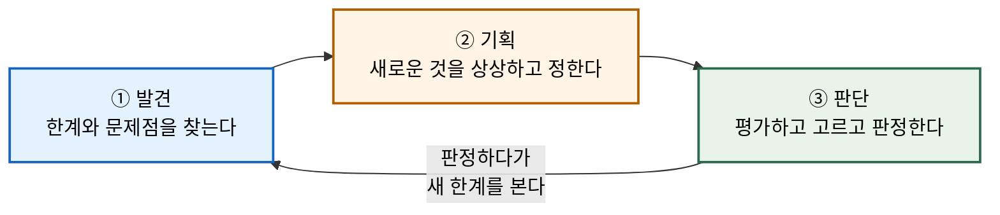
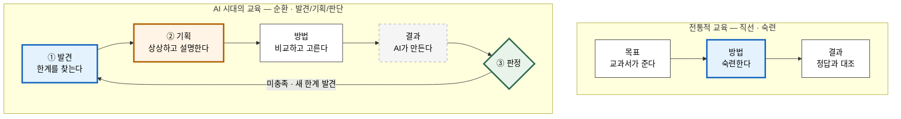

# 초인공지능시대에는 교육이 어떻게 변화되어 질까?

저자 소개:  

- 정갑주 (jeongk@konkuk.ac.kr & karpjoo@gmail.com)
- 소속:
    - 건국대학교 컴퓨터공학과
    - 인간 중심 스마트 인프라 연구소

유의사항:  

1. 모든 강의자료는 **저자의 개인적 지식, 경험 및 의견**을 토대로 작성되었습니다. 

- 그러나 AI 기술이 많은 기업과 전문가들에 의해서 비약적으로 발전하고 있는 상황에서 저자 혼자서 알 수 있는 것은 솔직히 매우 제한적일 수 밖에 없습니다. 따라서 더 이상 의미가 없는 과거 기술에 대한 설명, 최신 기술에 대한 잘못된 해석, 충분히 인정받지 못한 주관적 견해들이 포함되어 있을 수 있습니다. 
- 최대한 객관적이고 정확하게 설명하려고 노력은 했지만, 현 시점의 AI 기술 상황에서는 한계가 있을 수 밖에 없었다는 핑계로 양해를 구합니다.

2. 모든 강의자료의 주제와 내용은 저자가 직접 결정한 것들입니다. 그러나 **포함된 참고자료, 사례조사 및 예시는 LLM을 사용해서** 만들었습니다. 

- 그런데 LLM은 사실이 아닌 것을 그럴싸하게 지어내는 실수(환각)를 자주 합니다. 따라서 강의자료의 참고자료, 사례, 및 예시에 오류가 있을 수 있습니다. 
- 그런 LLM의 실수는 모든 출처를 철저하고 조사해야만 확인이 가능한데, 현재 강의자료를 만들고 있는 과정이라 아직 완전하지 검증을 못 했습니다. 혹시 오류가 있다면 미리 이해를 구합니다. 오류는 저자에게 알려주시길 부탁드립니다.

## 검증된 것을 익히는 공부에서, 한계를 찾아내고, 새로운 것을 기획하고, 골라서 판정하는 공부로

**핵심 요약**

배움에는 **세 가지 대상 (Target)**이 있다.

1. **목표/질문** (무엇을, 왜)
2. **방법/과정** (어떻게)
3. **결과** (무엇이 나왔나)

**전통적 교육에서는 이 세 가지가 모두 이미 알려져 있었다.**

- 목표는 교과서에 정리되어 있거나 교수가 지정해 줬다
- 방법은 검증된 것이 이미 있었고, **그것을 숙련하는 것이 곧 공부였다**
- 결과는 정답이 알려져 있고, 맞는지는 정답지, 교수가 알려줬다

**AI 시대에는 셋 다 성격이 바뀐다.**

- 목표는 **새로운 목표를 찾는 방법을 배우는 것**과 그것을 **AI에게 정확히 설명하는 방법을 배우는 것이 되어야 한다.
    - (1) **기존 이론, 기술 또는 방법의 한계와 문제점**을 찾아내는 방법을 배워야 한다.
    - (2) **새로운 것을 상상하고 기획**하는 방법을 배워야 한다.
- 방법은 AI가 이미 **좋은 방법을 충분히 많이** 알고 있다. 학생은 AI에게 선택을 맡기거나, 그것들을 **평가하고 선택**하는 방법을 배워야 한다.
- 결과는 **AI가 만든다.** 학생은 그것이 원래 목표를 충족했는지를 **판정**할 수 있는 방법을 배워야 한다.

**그래서 교육이 학생들에게 키워주어야 할 것이 바뀐다. 네 가지다.**

> **① 비판적 발견 — 기존의 것의 한계와 문제점을 찾아낼 수 있다**
> **② 창의적 기획 — 새로운 것을 상상하고 기획해 낼 수 있다**
> **③ 현명한 선택 — 여러 기회와 가능성에 대해 평가하고, 판단하고, 선택할 수 있다**
> **④ 엄격한 판정 — 결과물에 대해 목표가 달성되었는 지를 판정할 수 있다**

**한 줄 요약**

- 공부의 중심이 **숙련(mastery)**에서 **발견(Discovery), 기획(Design), 선택 (Selection), 판정(Judgment)으로** 옮겨간다.
- 무엇이 문제인지 **찾아내고**, 무엇을 할지 **상상해서 정하고**, 어느 것이 나은지 **골라서 판정하고**, **목표가 달성되었는지 판단**하는 것 — 이 넷이 새로운 공부의 내용이다.

---

## 1. 전통적 교육: 네 가지가 모두 이미 알려져 있었다

### 1.1 목표는 주어졌다

학생이 **무엇을 공부할 지**를 고민한 적은 거의 없다. 교과서에 나와 있고, 과제 지시문에 적혀 있었다.

> "이진 탐색 트리를 구현하고 삽입·삭제·탐색을 지원하시오."

이 목표는 **누군가 이미 검증한 좋은 목표**다. 수십 년간 수많은 학생이 같은 것을 만들었고, 그것이 배울 가치가 있다는 사실은 이미 충분히 알려져 있다. **학생은 목표를 의심할 필요도, 배울 지 말 지를 고민할 필요가 없었다.**

여기서 첫 번째와 두 번째 능력이 자랄 자리가 없어진다.

- **의심할 필요가 없는 것에서는 한계를 찾는 훈련**이 생기지 않는다.
    - 교과서의 알고리즘은 "옳은 것"으로 주어졌고, 학생의 일은 그것을 받아들이는 것이었다.
    - 그러니 **① 발견 능력**은 전통 교육에서 사실상 훈련시키기 어려웠다.
- **아직 없는 것을 상상해서 형태를 부여하는 일**은, 정해진 방법을 숙련하는 4년 안에 들어 있지 않았다.
    - 교과서에 아직 없었던 것을 기록할 수는 없고, 당연히 정립된 교육 내용에 넣을 수가 없었다.
    - 그러니 **② 기획 능력**은 전통 교육에 포함시키기 어려웠다.

### 1.2 방법은 검증된 것이 있었고, 숙련이 곧 공부였다

이진 탐색 트리를 만드는 방법은 이미 확립되어 있다. 교과서에 알고리즘과 의사코드가 있고, 교수가 강의에서 설명한다. 학생이 할 일은 **그것을 공부해서, 자기 손으로 반복해서 익히는 것**이었다.

> **이것이 전통적 공부의 정체다: 검증된 방법을 몸에 익히는 것.**

"새로운 방법을 모색하고 연구하라는 요구"는 **대학원**에 가서야 나왔다. 그것마저도 대부분은 이미 **연구 논문들에 발표된 개념과 이론**을 공부하는 것이었다. 학부 4년은 사실상 **인류가 이미 찾아놓은 방법들을 순서대로 숙련하는 과정**이었다.

여기서 세 번째 및 네 번째 능력이 이 자랄 자리도 없어진다. 

- 검증된 방법과 결과가 있기 때문에 **다양한 방법들 중에서 선택을 고민**하거나 **정답을 의심**할 필요가 없었다.
- 제출한 코드가 맞았는지는 학생이 판단하지 않았다. **컴파일러가, 테스트 케이스가, 채점 프로그램이, 교수가 판단해 줬다.**

여기서 매우 중요한 사실이 하나 나온다.

- **전통 교육에서 학생은 "판정자" 역할을 해본 적이 거의 없다.**
- 옳고 그름을 판단하는 일은 항상 외부(정답지·컴파일러·교수)가 대행했기 때문이다.

교육 과정에서 세 번째와 네 번째 능력이 구조적으로 **학생의 영역으로부터 벗어나는 외주화**가 일어나게 되었다. 이 점이 뒤에서 결정적인 문제가 된다.

### 1.3 그래서 결과만 채점해도 됐다

세 요소가 다 알려져 있고 학생이 직접 만들어야 했으므로, **마지막 결과 ④**에 **앞의 세 개 (②, ③, ④)가 압축**되어 담겼다.

- 코드가 돌아간다 → 문제를 이해했다 (목표를 알았다)
- 코드가 돌아간다 → 코딩 방법을 익혔다 (방법을 선택했고, 숙련했다)

**앞에서 틀리면은 반드시 뒤에서 틀리게 되어 있었다.** 그래서 결과를 채점하는 것으로 충분했다.

**한 방향, 한 번에 끝나는 직선 구조**였다. 학생의 역할은 **재현자**였다.

- **정리하면, 전통 교육은 발견·기획·판단 세 능력을 모두 필요로 하지 않았다.**
- 없어서 안 가르친 것이 아니라, **필요가 없었기 때문에 가르칠 이유가 없었다.**

**그 필요가 이제 생겼다!**

---

## 2. AI 시대: 네 가지가 모두 성격을 바꾼다

### 2.1 목표 — 한계를 찾아내고, 새로운 것을 상상할 수 있어야 한다

AI 시대에는 인간이 **방법을 배우고, 결과를 직접 만드는 노력**을 할 필요가 없어졌다.

- AI에게는 말만 하면 된다. 그러면 알아서 문제도 해결해 주고 제품도 만들어 준다.
- 그것도 인간보다 월등하게 뛰어난 저비용/고효율로 일을 해 준다.

전통적 교육에서 가르쳤던 것들이 이제는 더 이상 배울 필요가 없어졌다. AI가 알고 있고, 할 줄 알기 때문이다.

- 이미 알려진 목표들은 AI가 다 이해하고 있다.
- 이미 알려진 온갖 방법들은 AI가 다 알고 있다.
- 목표를 지시만 하면 AI는 곧바로 결과물을 가져다 준다.

**그런데 바로 여기에 결정적인 비대칭이 있다.**

- **AI가 잘하는 것은 "이미 알려진 것의 범위 안에서 잘하는 것"이다.**
- 그리고 **기존 이론과 방법의 한계와 문제점들**에 대해서도 잘 알고 있다.
- 그러나 그런 한계와 문제점에 대해서 **걱정하지도 않고 경고도 하지 않는다**. **사람으로부터 그것에 대해서 질문을 받을 때**까지는.

그래서 목표 자리에는 세 가지 능력이 새로 필요해진다.

**① 기존의 것의 한계와 문제점을 찾아내는 능력**

- 모든 새로운 목표는 **불만에서 출발한다.** 지금 쓰는 도구가 불편하다, 지금 방식이 이 상황에서는 안 맞는다, 이 논문의 가정은 우리 환경에서 성립하지 않는다.
- 이것은 **비판적 사고**이고, 동시에 **관찰 능력**이다. 불편을 불편으로 느낄 줄 알아야 문제가 보인다.
- 주의: AI에게 "이 기술의 한계를 알려줘"라고 물으면 **이미 문헌에 적혀 있는 한계**를 잘 정리해 준다. 그러나 그것은 **남이 이미 발견한 한계**다. 당신이 찾아야 하는 것은 **아직 아무도 문장으로 쓰지 않은 한계**다.

**② 새로운 것을 상상하고 기획하는 능력**

- 한계를 찾았다고 해서 대안이 저절로 나오지 않는다. **"그럼 무엇이 있어야 하는가"를 형태로 만드는 별도의 능력**이 필요하다.
- 이것이 **창의적 사고**이며, 여기서 말하는 창의는 "번뜩임"이 아니라 **기획**이다. 무엇을, 누구를 위해, 어떤 조건 아래서, 무엇이 되면 성공인지를 정하는 일.
- 판단 기준은 하나다. **"무엇을 만들면 가치가 있는가."**

**③ 그것을 정확하게 전달하는 능력**

- **새로운 공부 대상**: 자기 의도를 애매함 없이 문장으로 만드는 훈련.
- 이것은 글쓰기 능력이 아니라 **명세 능력**이다.

잘 알려진 것들을 공부할 때는 그냥 암기해서 사용하면 되기 때문에 이런 능력이 과소평가될 수 밖에 없다. 그러나 머릿속에 있는 새로운 생각과 목표는 명확하게 설명하지 않으면 AI는 다르게 해석할 가능성이 매우 높다.

- 대표적인 이유는 자신의 생각을 정확히 표현하는 훈련이 되지 않은 사람들은 대부분 **머릿속에서 당연하게 여겼던 맥락들을 문장에서 표현할 줄 모른다**는 것이다.
- 작가들이 오랜 시간 자신의 생각을 글로 표현하느라 고생하는 이유이기도 하다.

### 2.2 방법 — AI가 여러 개 찾아오고, 학생이 평가해서 고른다

목표만 주면 AI는 방법을 **여러 개** 제시한다. 여기서 학생에게 선택지가 생긴다.

| 선택 | 내용 | 언제 적절한가 |
|---|---|---|
| **전적으로 맡긴다** | "알아서 제일 좋은 방법으로 해줘" | 이미 잘 아는 영역, 결과가 중요하지 않은 부수 작업 |
| | | |
| **제시된 것 중 고른다** | AI가 낸 3가지를 비교하고 하나를 선택 | 중요한 결정, 배우는 중인 영역 |
| | | |
| **직접 정한다** | 방법을 지정하고 구현만 맡긴다 | 제약이 명확할 때 |

**중요한 것은 이 선택 자체가 새로 생겼다는 사실이다.** 

- 전통 교육에는 이 칸이 없었다. 사람이 직접 무언가를 할 때는 거의 대부분 여러 방법 중 하나만 선택해서 하지, 모든 방법을 다 시도하지는 않는다. 따라서 **여러 방법의 결과를 나란히 놓고 비교해서 선택하는 경험 자체가 없었다.**
- 그런데 AI는 세 가지를 다 만들어 준다. **비교가 처음으로 실제로 가능해졌다.** 기회가 늘어난 만큼 **평가 능력이 없으면 그 기회를 쓸 수 없다.**
- 그리고 고르려면 알아야 한다. **방법을 공부하는 이유**가 "실행하기 위해"에서 **"평가하고 고르기 위해"**로 바뀐 것이지, 공부하지 않아도 된다는 뜻이 아니다.

### 2.3 결과 — AI가 만들고, 학생이 판정한다

결과는 AI가 만든다. 그러면 학생에게 남는 일은 무엇인가?

> **원래 의도했던 목표를 충족했는지 판정하는 일.**

그리고 충족하지 못했다면 세 가지 중 하나를 한다.

- **목표를 더 설명한다** (내 설명이 부족했다)
- **다른 방법을 고른다** (방법 선택이 틀렸다)
- **목표 자체를 다시 세운다** (판정 과정에서 **원래 목표의 한계**를 발견했다)

**여기서 직선이 끊기고 루프가 생긴다.** 그리고 세 번째 항목이 특히 중요하다. **판정은 다시 발견으로 돌아간다.**

**이 그림에서 학생이 서 있는 자리는 세 곳이다: 출발점(목표), 갈림길(방법 선택), 그리고 마름모(판정).**
가운데 실행 구간은 AI의 자리다.

> **그림에서 가장 중요한 것은 마름모(◇)다.**
> 이 판정이 루프를 돌리는 엔진이다. 판정할 수 없으면 루프가 돌지 않고, 루프가 돌지 않으면 첫 번째 결과를 그냥 받아들이게 된다.
>
> 그런데 **전통 교육은 이 판정 능력을 소홀히 할 수 밖에 없었다.** 정답지가 있는 상황에서는 굳이 다양한 오답을 시도하고 거기서 문제점을 파악해 정답을 찾아가는 수고를 하지 않기 때문이다.
>
> **AI 시대 교육이 채워야 할 가장 큰 빈칸이 여기다.**

---

### 3.3 네 능력은 순서가 아니라 순환 루프다

가장 흔한 오해는 이 셋을 1 → 2 → 3 → 4의 단계로 보는 것이다. 실제로는 네 가지 단계는 **언제든지 문제가 생기면 이전 단계 중의 하나로 되돌아 가야 한다**.

---

## 4. 한눈에 보는 비교

| | 전통적 교육 | AI 시대의 교육 |
|---|---|---|
| **목표/질문** | 이미 알려지고 검증된 것 교과서·교수가 지정 | **한계를 발견하고 새것을 기획** + AI에게 정확히 설명해야 함 |
| | | |
| **방법/과정** | 이미 알려지고 검증된 것 **이것을 숙련하는 것이 공부** | AI가 여러 방법을 찾아옴 **평가해서 위임하거나 선택** |
| | | |
| **결과** | 정답이 알려져 있음 정답지와 대조 | AI가 여러 개를 만듦 **학생이 비교하고 판정** |
| | | |
| **길러야 할 능력** | **숙련** — 검증된 것을 몸에 익힘 | **① 발견 ② 기획 ③ 선택 ④ 판정** |
| | | |
| **학생의 역할** | **재현자** | **발견자 · 기획자 · 선택자 · 판정자** |
| | | |
| **판단의 주체** | 외부 (교수·정답지·컴파일러) | **학생 자신** |
| | | |
| **진행 형태** | 직선 — 한 번에 끝 | **순환 — 선택/판정 → 발견 → 재기획** |
| | | |
| **방법을 배우는 이유** | 실행하기 위해 | **평가하고 고르고 판정하기 위해** |
| | | |
| **실패의 모습** | 못 한다 — **성적이 나쁘다. 곧바로 알 수 있다** | AI 결과의 문제를 학생도 교수도 못 알아본다 — **성적은 나쁘지 않다. 나중에 문제가 된다** |
| | | |
| **잘하는 학생** | 정확하고 빠르게 재현한다 | **좋은 문제를 찾아내고, 근거 있게 고르고, 정확히 판정한다** |

---

## 5. 세 가지 오해 방지

### 오해 ①: "AI가 다 하니 방법은 안 배워도 된다"

**틀렸다. 배우는 이유가 바뀌었을 뿐이다.**

- 캐싱과 인덱싱의 차이를 모르면 고를 수 없고, 선형 탐색과 해시 탐색의 차이를 모르면 판정할 수 없다.
- 그러나 무엇이 덜 중요해졌는지는 명확하다.

| | AI 시대의 가치 |
|---|---|
| **원리** — 알고리즘, 복잡도, 운영체제·네트워크·DB의 구조 | **더 중요해짐** — 고르고 판정하는 근거가 된다 |
| | |
| **설계 판단** — 패턴, 보안, 데이터 모델링, 성능 | **더 중요해짐** — 기획할 때 쓰인다 |
| | |
| **표층** — 특정 프레임워크 API, 명령어 옵션, 문법 | **덜 중요해짐** — 마음껏 맡겨도 된다 |

### 오해 ②: "기획만 잘하면 된다"

**틀렸다. 기획은 처음부터 완전할 수 없다**. 

- 목표는 판정을 통해 완성된다. 그러므로 **기획과 판정은 분리된 두 능력이 아니라 하나의 루프**다.

### 오해 ③: "한계를 찾는 건 비판만 하면 되는 쉬운 일이다"

**틀렸다. 그리고 이 오해가 가장 흔하다.**

- "이 기술은 이런 한계가 있다"는 말은 AI도 잘한다. 문헌에 적힌 것을 정리하면 되기 때문이다. **진짜 발견은 문헌에 없는 것을 찾는 일**이고, 그러려면 **그 기술을 실제로 써봐야 한다.**

**손을 놓아도 되지만, 손을 대본 적이 없어서는 안 된다.**

---

## 6. 참고: 실증 근거 (간략)

- **Shen & Tamkin (2026, Anthropic)** — 무작위 통제 실험(n=52). AI를 쓴 집단은 과제를 **전원 완료**했지만 이해도 평가에서 **17% 낮은 점수**를 받았고, 속도 이득은 유의하지 않았다. 격차가 가장 큰 항목은 **디버깅**(= 판정 능력).
  - 같은 연구에서 **개념 질문만 하고 코드는 직접 짠 집단이 이해도 최상위이면서 속도도 상위권**이었다. → 속도와 학습이 반드시 상충하지는 않는다.
- **METR (2025)** — 숙련 개발자들은 AI가 자신을 20% 빠르게 했다고 **믿었지만** 실측은 19% 느렸다. → **자기평가는 신뢰할 수 없다.** (2026년 업데이트에서 현재는 상황이 달라졌을 가능성을 밝힘)

**공통 메시지**: AI를 얼마나 썼는지는 결과를 예측하지 못한다. **무엇을 맡기고 무엇을 직접 판정했는지가 예측한다.**

> *주: 위 두 연구는 저자가 직접 재현하거나 원문 전체를 검증한 것이 아니다. 인용 전 원문 확인을 권한다. (유의사항 2 참조)*

---

## 10. 마무리

**세 문장 요약**

1. 전통 교육에서는 목표·방법·결과가 모두 이미 알려져 있었다. 공부란 **검증된 방법을 숙련하는 것**이었다.
2. AI 시대에는 **기존의 것의 한계를 찾아내고(발견)**, **새로운 것을 상상해서 기획하고(기획)**, **여러 가능성을 평가·판단·선택하는 것(판단)** 이 세 가지가 공부의 내용이 된다.
3. 그리고 **판단이 앞으로 나아갈 수 있게 한다.** 다양한 방법에서 선택을 할 수 있어야 불필요한 낭비를 피할 수 있고, 결과의 문제점을 판정할 수 있어야 부족한 점을 개선시키기 위한 **다음 목표**을 다시 결정할 수 있다.
