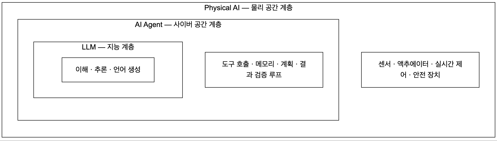
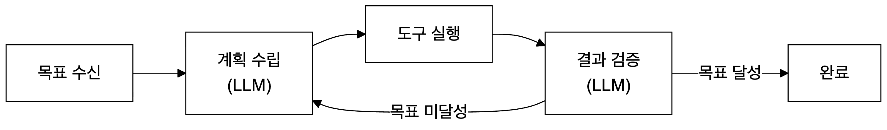

# LLM, AI Agent, Physical AI: 오래된 역사, 갑작스런 도약


저자 소개:

- 정갑주 (jeongk@konkuk.ac.kr & karpjoo@gmail.com)
- 소속:
  - 건국대학교 컴퓨터공학과
  - 인간 중심 스마트 인프라 연구소

유의사항:

1. 모든 강의자료는 **저자의 개인적 지식, 경험 및 의견**을 토대로 작성되었습니다.

- 그러나 AI 기술이 많은 기업과 전문가들에 의해서 비약적으로 발전하고 있는 상황에서 저자 혼자서 알 수 있는 것은 솔직히 매우 제한적일 수 밖에 없습니다. 따라서 더 이상 의미가 없는 과거 기술에 대한 설명, 최신 기술에 대한 잘못된 해석, 충분히 인정받지 못한 주관적 견해들이 포함되어 있을 수 있습니다.
- 최대한 객관적이고 정확하게 설명하려고 노력은 했지만, 현 시점의 AI 기술 상황에서는 한계가 있을 수 밖에 없었다는 핑계로 양해를 구합니다.

2. 모든 강의자료의 주제와 내용은 저자가 직접 결정한 것들입니다. 그러나 **포함된 참고자료, 사례조사 및 예시는 LLM을 사용해서** 만들었습니다.

- 그런데 LLM은 사실이 아닌 것을 그럴싸하게 지어내는 실수(환각)를 자주 합니다. 따라서 강의자료의 참고자료, 사례, 및 예시에 오류가 있을 수 있습니다.
- 그런 LLM의 실수는 모든 출처를 철저히 조사해야만 확인이 가능한데, 현재 강의자료를 만들고 있는 과정이라 아직 완전한 검증을 못 했습니다. 혹시 오류가 있다면 미리 양해를 구하고, 저자에게 알려주시길 부탁드립니다.

---

## 이 강의의 중심 주장: 지능 · 사이버 공간 · 물리 공간을 다루는 세 갈래 기술의 역사와 통합

**LLM, AI Agent, Physical AI는 "요즘 유행하는 세 가지 신기술"이 아니다.**

- 이 셋은 **수십 년 동안 각자 따로 발전해온 세 갈래의 기술 계보**가 각각 도달한 현재 지점이다.

- 지금 일어나고 있는 진짜 변화는 새 기술의 등장이 아니라 **이 세 갈래가 계층 구조로 합쳐지고 있다는 것**이다.


---

## 1. 배경: 왜 "역사"부터 이야기하는가

### 1.1 지금 우리가 겪고 있는 혼란

2022년 말 ChatGPT가 등장한 이후, AI는 갑자기 전 세계의 주목을 받기 시작했습니다. 그리고 그때부터 지금까지 너무나 빠른 속도로, 너무나 많은 영역으로 기술이 확장되었습니다.

그 결과 대부분의 사람들은 다음 두 가지 질문에 제대로 답하지 못합니다.

- **"AI는 정확히 무슨 시스템인가?"**
- **"AI는 무슨 시스템으로 진화하고 있는가?"**

혼란의 증상은 이렇게 나타납니다.

| 흔한 혼란 | 왜 생기는가 |
|---|---|
| "AI = ChatGPT" 라고 생각한다 | 가장 먼저 접한 것이 챗봇이라서 |
| | |
| 챗봇, 에이전트, 로봇을 전부 "AI"라는 한 단어로 부른다 | 세 가지의 **작동 방식이 근본적으로 다르다는 것**을 배운 적이 없어서 |
| | |
| 새 제품이 나올 때마다 "완전히 새로운 것"으로 느낀다 | **그 이전 기술 계보를 모르기 때문에** 무엇이 진짜 달라진 것인지, 무엇이 새 것인지 판별할 기준이 없어서 |
| | |
| "AI가 다 알아서 해준다"고 과신하거나, 반대로 "다 거품"이라고 무시한다 | 기술의 **능력 범위와 한계**를 구분하는 축을 갖고 있지 않아서 |

### 1.2 그래서 역사가 중요한 이유

AI는 갑자기 하늘에서 떨어진 기술이 아닙니다. **오랜 세월에 걸쳐 축적되어 온 기술**이고, 지금의 AI도 그 토대 위에서 발전하고 있습니다.

역사를 알면 세 가지가 가능해집니다.

1. **판별력** — 새로 나온 기술이 "진짜 도약"인지 "이름만 바꾼 기존 기술"인지 구분할 수 있다.
2. **예측력** — 각 계보가 어느 방향으로 움직여 왔는지 알면, 다음에 무엇이 올지 대략 짐작할 수 있다.
3. **한계 인식** — 각 기술이 **어떤 문제를 풀려고 태어났는지**를 알면, 그 기술이 풀 수 **없는** 문제도 자연히 보인다.

**학습 원칙:** 최신 기술을 외우지 말고, **기술 계보를 이해해야 합니다.** 최신 기술은 6개월이면 바뀌지만, 계보는 수십 년 단위로 유지됩니다.

---

## 2. AI 기술의 분류와 발전 역사

### 2.1 세 갈래로 나누는 기준: "무엇을 다루는 시스템인가"

AI 관련 기술은 **다루는 대상**을 기준으로 세 가지로 정리할 수 있습니다. 이 세 갈래는 실제로 오랫동안 각각 독립적으로 연구·개발되어 왔고, 최근 LLM의 등장으로 세 갈래 모두가 동시에 비약적으로 도약하고 있습니다.

| 갈래 | 다루는 대상 | 최근까지 (기존 기술) | 지금부터 (새로운 주역) |
|---|---|---|---|
| **① 지능을 다루는 시스템** | 인식·이해·추론 | Perception 시스템들 (음성인식, 영상인식, 자연어처리, 패턴 분류) | **LLM** |
| | | | |
| **② 사이버 공간을 다루는 시스템** | 디지털 세계의 자원과 작업 | 클라우드 시스템, 디지털 트윈, 워크플로 자동화 | **AI Agent** |
| | | | |
| **③ 물리적 공간을 다루는 시스템** | 실제 세계의 사물과 환경 | 사물인터넷(IoT), 제어 시스템, 산업용 로봇 | **Physical AI** |

### 2.2 각 갈래는 어떤 문제를 풀려고 시작되었나

#### ① 지능을 다루는 시스템: "기계가 세상을 알아볼 수 있는가?"

- **출발 질문:** 기계가 사람의 말을 알아듣고, 사진 속 물체를 알아보고, 상황을 판단할 수 있는가?
- **발전 경로:**
  - 규칙 기반 전문가 시스템 → 통계적 기계학습 → 딥러닝 기반 **Perception** (음성인식, 영상인식, 번역)
  - Perception 시스템의 특징: **하나의 시스템이 하나의 인식 과제만** 잘 수행 (얼굴 인식 모델은 번역을 못 함)
- **LLM이 바꾼 것:** 하나의 모델이 **여러 종류의 이해·추론 과제를 범용으로** 처리하기 시작. 인식(perception)을 넘어 **언어로 추론(reasoning)** 하는 단계로 올라섬.
- **의미:** 이 갈래는 이제 "알아보는 기계"에서 **"생각하는 기계"** 로 넘어갔다.

#### ② 사이버 공간을 다루는 시스템: "디지털 자원을 어떻게 자동으로 다루는가?"

- **출발 질문:** 데이터, 서버, 프로그램, 업무 절차를 사람 손을 덜 거치고 처리할 수 있는가?
- **발전 경로:** 이 갈래 안에는 목적이 다른 두 흐름이 나란히 발전해 왔다.
  - **자원 가상화 흐름:** 배치 처리 → 분산 시스템 → **클라우드**(서버·저장소 등 자원의 가상화·자동 배치)
  - **절차 자동화 흐름:** 워크플로 관리 시스템(BPM, 1990년대) → **RPA**(정해진 규칙에 따라 화면·업무를 대신 실행)
  - 참고로 **디지털 트윈**(현실의 물리적 자산·공정을 사이버 공간에 복제해 모의·분석하는 기술)도 이 시기에 함께 발전했지만, RPA의 전 단계가 아니라 **"물리 세계를 사이버 공간에 반영"하는 별도 목적의 기술**이다. 이 기술은 뒤에서 다룰 ③ 물리 공간 갈래와 ② 사이버 공간 갈래를 잇는 다리 역할을 하며, Physical AI 단계에서 다시 중요해진다.
  - 기존 자동화(RPA·워크플로)의 결정적 한계: **사람이 절차를 전부 미리 정해줘야** 작동. 예상 못한 상황이 오면 멈춤.
- **AI Agent가 바꾼 것:** 절차를 사람이 짜주는 대신, **LLM이 목표를 받아서 스스로 절차를 만들고 조정**한다.
- **의미:** 이 갈래는 "정해진 대로 실행하는 자동화"에서 **"스스로 계획하는 자동화"** 로 넘어갔다.

#### ③ 물리적 공간을 다루는 시스템: "기계가 실제 세계에서 일할 수 있는가?"

- **출발 질문:** 센서로 실제 환경을 측정하고, 액추에이터로 물리적 작업을 수행할 수 있는가?
- **발전 경로:**
  - 제어 이론(PID 제어) → 산업용 로봇(정해진 궤적 반복) → 사물인터넷(IoT, 환경을 광범위하게 센싱) → 자율주행 연구
  - 기존 기술의 결정적 한계: **정해진 환경, 정해진 작업**에서만 작동. 공장 로봇은 부품 위치가 몇 cm만 틀어져도 실패.
- **Physical AI가 바꾼 것:** 시각-언어-행동(VLA) 모델과 로봇 파운데이션 모델을 통해, **학습한 적 없는 물체·환경·작업에도 대응**하기 시작.
- **의미:** 이 갈래는 "정해진 동작을 반복하는 기계"에서 **"상황을 보고 판단하는 기계"** 로 넘어갔다.

### 2.3 세 갈래에서 동시에 일어난 공통 변화

세 갈래의 역사를 나란히 놓으면 **같은 형태의 도약**이 동시에 일어났다는 것이 보입니다.

| 갈래 | 이전의 한계 | 공통된 도약의 형태 |
|---|---|---|
| ① 지능 | 과제별 전용 모델 | **전용 => 범용** |
| | | | 
| ② 사이버 | 사람이 절차를 지정 | **지정된 절차 => 자율적 계획** |
| | | |
| ③ 물리 | 정해진 환경·작업만 | **폐쇄된 환경 => 열린 환경** |

**핵심:** 세 갈래에서 동시에 같은 형태의 도약이 일어난 이유는 우연이 아니다.
- **세 갈래 모두 LLM이라는 공통 부품을 얻었기 때문**이다.

---

## 3. 기술 발전의 변화: 독립 → 계층적 통합

### 3.1 무엇이 달라졌는가

- **최근까지:** 세 가지 기술은 **독립적으로** 연구·개발되었다. 자연어처리 학회, 클라우드 학회, 로보틱스 학회는 서로 다른 사람들이 모이는 자리였다.
- **지금부터:** 세 가지가 **계층적(Layered) 구조로 연결되고 통합**되고 있다.

### 3.2 왜 하필 지금 통합되는가

통합이 가능해진 이유는 단순합니다. **LLM이 세 갈래 모두가 필요로 했던 "공통 두뇌"를 제공했기 때문**입니다.

| 갈래가 오랫동안 원했지만 없었던 것 | LLM이 제공한 것 |
|---|---|
| 사이버 자동화: "사람 말로 지시하면 알아듣고, 예외 상황을 스스로 판단하는 부품" | 자연어 이해 + 계획 수립 + 재계획 |
| | |
| 물리 로봇: "처음 보는 물체와 지시를 일반화해서 해석하는 부품" | 범용 개념 이해 + 언어로 표현된 목표 해석 |

즉 **①번 갈래의 결과물(LLM)이 ②번과 ③번 갈래의 부품이 된 것**입니다. 이것이 "계층적 통합"의 정확한 의미입니다.

### 3.3 계층 구조

흔한 오해는 LLM, Agent, Physical AI가 "서로 다른 종류의 시스템"이라는 생각입니다. 실제로는 **서로 별개가 아니라, 바깥이 안쪽을 감싸는 동심원**입니다.




- **Agent는 LLM을 "두뇌"로 삼아** 그 위에 도구·메모리·계획 능력(신체의 내부 기관)을 얹은 것이다.
- **Physical AI는 Agent의 능력을 "두뇌와 내부 기관"으로 삼아** 그 위에 외부 기관(센서·모터)과 실시간 제어·안전 장치를 얹은 것이다.
- 즉 **바깥 층은 안쪽 층을 포함한다.** 로봇도 결국 안쪽에서는 언어모델로 생각한다.

### 3.4 계층을 가르는 축: 행동 공간(Action Space)

세 계층을 구분하는 결정적 기준은 "얼마나 똑똑한가"가 아니라 **"그 지능의 행동이 어디까지 미치는가"** 입니다.

```
        LLM              Agent                Physical AI
        인지 공간   →    사이버 공간     →    물리 공간
        (말과 글)        (파일·API·웹)        (물체·기계·사람)
```

이 축을 잡으면 뒤에 나오는 모든 차이(피드백 루프, 시간 제약, 위험 수준)가 자동으로 설명됩니다.

---

## 4. 개별 기술 소개

각 기술을 **① 역사적 위치 -> ② 기능과 역할 -> ③ 구조적 한계 -> ④ 위험 수준** 의 순서로 살펴봅니다.

---

### 4.1 LLM — "언어로 생각하는 두뇌"

> **도입 질문:** "ChatGPT나 Claude한테 뭔가 물어본 적 있으신가요? 그때 AI가 여러분을 대신해서 무언가를 '실행'해줬나요, 아니면 '답변'만 해줬나요?"

#### ① 역사적 위치

Perception 시스템의 계보를 잇되, **인식을 넘어 추론으로** 넘어간 지점. 과제별 전용 모델의 시대를 끝내고 범용 모델의 시대를 연 전환점.

#### ② 기능과 역할

- **하는 일:** 입력된 텍스트(또는 이미지)를 이해하고, 방대한 학습 지식을 바탕으로 다음에 올 말을 추론해 답을 생성한다.
- **입력:** 텍스트 / 이미지 (멀티모달)
- **출력:** **텍스트** — 요약, 번역, 설명, 코드 작성, 아이디어
- **잘하는 것:** 언어 이해, 추론, 지식 정리, 초안 작성, 패턴 인식
- **작업 형태:**
  - 인간의 요청에 대응해 **생각만 하고 결과를 응답**한다.
  - 요청-응답은 원칙적으로 **일회성** (한 번 답하고 끝).
  - 챗봇은 이전 대화 내용을 컨텍스트로 다시 넣어주는 방식으로 맥락을 어느 정도 유지한다.
- **계층 내 역할:** 상위 두 계층의 **두뇌 부품**.

#### ③ 구조적 한계

- **스스로는 아무것도 실행하지 못한다.** "검색해 보겠다"고 말해도 실제로 접속하지 않고, "파일을 고쳐준다"고 해도 저장하지 않는다.
- **세계와의 직접 접촉이 없다(grounding 부재).** 학습된 텍스트 속 세계만 알고, 지금 이 순간의 실제 상태는 모른다.
- **환각(hallucination):** 사실이 아닌 것을 그럴싸하게 생성한다.

#### ④ 위험 수준: **낮음 — 단, 조건부**

- LLM 자체는 응답을 내놓을 뿐이고, **그 응답을 어떻게 처리할지는 전적으로 인간의 선택**이다. 그래서 시스템 차원의 직접적 위험은 낮다.
- 그러나 인간이 LLM의 응답을 **과도하게 신뢰하거나, 왜곡해서 이해하거나, 적용 방법을 모를 때** 심각한 위협이 될 수 있다.
- 즉 **LLM 단계의 위험은 기계의 위험이 아니라 사용자의 위험**이다.

#### 예시

이메일 내용을 작성해 주지만, 직접 전송하지는 못합니다. LLM의 최신 버전은 이미 어느 정도 **AI Agent로 진화했기 때문**에 컴퓨터 내의 Email 프로그램의 접근을 요청합니다. 이것은 LLM에 AI Agent 기능이 추가된 것이지 LLM이 발전한 것은 아닙니다.

```
        >> 사용자:
            ... 이런 내용으로 이메일을 보내줘!
        >> LLM:
            (보낼 이메일 문안을 텍스트로 생성)
```

---

### 4.2 AI Agent — "컴퓨터를 조작하는 실무자"

> **질문:** "AI한테 코드를 짜달라고 했더니, AI가 직접 파일을 만들고 실행까지 해준 걸 본 적 있나요? 그건 방금 본 챗봇과 뭐가 다를까요?"

#### ① 역사적 위치

클라우드(자원 가상화)와 워크플로·RPA(절차 자동화)의 계보를 잇되, **절차를 사람이 지정하던 자동화에서 스스로 계획하는 자동화로** 넘어간 지점.

#### ② 기능과 역할

- **하는 일:** LLM의 추론을 **행동으로 연결**한다. 목표를 받으면 스스로 계획을 세우고, 도구(검색·코드 실행기·API·브라우저)를 호출해 단계적으로 처리하며, 중간 결과를 보고 다음 행동을 조정한다.
- **입력:** 목표 + 디지털 환경의 상태
- **출력:** **디지털 행동** — 검색 실행, 코드 실행, 파일 수정, 이메일 발송, DB 조회
- **작업 형태:**
  1. 인간이 Task(목표)를 지시한다.
  2. Agent가 LLM을 사용해 실행 계획을 수립한다.
  3. 컴퓨터 안의 도구를 실행해 계획을 수행한다. — 즉 **디지털 세계 안에서 수행 가능한 작업**이어야 한다.
  4. **내부 피드백 루프:** 수행 결과(에러 메시지, 검색 결과 등)를 LLM으로 분석해 목적 달성 여부를 확인하고, 실패했으면 다시 계획을 세워 재실행한다.
  5. 성공할 때까지, 또는 더 이상 반복이 의미 없다고 판단될 때까지 이 루프를 반복한다.



- **잘하는 것:** 여러 단계로 이루어진 디지털 작업의 자동화, 도구 조합, 오류를 보고 다시 시도하기(재계획)

#### ③ 구조적 한계

- 계획이 틀어졌을 때의 **복구**가 어렵다.
- 오래 이어지는 작업의 **상태(메모리) 관리**가 어렵다.
- 두뇌가 LLM이므로 **LLM의 한계(환각)를 그대로 물려받는다.** 다만 실행 결과라는 현실 피드백이 일부 교정 역할을 한다.
- **잘못된 행동의 통제** — 엉뚱한 결제, 엉뚱한 삭제를 막는 것이 어렵다.

#### ④ 위험 수준: **높음**

- Agent는 컴퓨터 안의 파일을 **읽고, 수정하고, 삭제**할 수 있다. 잘못 작동하면 복구가 거의 불가능한 피해를 줄 수 있다.
- 네트워크 통신, DB, 외부 API 등 다양한 도구를 사용할 수 있으므로, **오작동이나 악용 시 치명적**이다.
- LLM과의 결정적 차이: **작업 과정이 루프 안에 숨어있다.** 계획-실행-검증이 전부 기계 안에서 돌기 때문에, 인간은 결과를 사후에 볼 뿐이다.

#### 예시

- **도구:** Claude Code(터미널에서 지시하면 코드를 작성·실행·수정하는 코딩 에이전트), OpenAI Codex, Google Antigravity(에이전트 기반 개발 환경)
- **시나리오:**
  - 목표: "지난주 매출 데이터를 찾아 그래프로 만들고 요약 메일을 팀에 보내줘"
  - 실행: 실제로 파일을 찾고, 코드를 돌려 차트를 만들고, 메일을 발송한다.
  - 위험: AI 실수로 잘못된 차트를 만들어서 메일로 보낼 수 있다. 오류 때문에 현실적으로 문제가 발생할 때까지 인간이 확인할 수 있는 방법이 없다.


**용어 주의: "Agent Washing"** 

- 요즘 단순 챗봇이나 기존 자동화 도구를 "에이전트"라고 포장하는 현상이 많습니다. 
- 진짜 Agent의 기준은 **스스로 계획하고, 도구를 쓰고, 결과를 보고 조정하는 자율적 순환**이 있는지 여부입니다.

---

### 4.3 Physical AI — "현장에서 일을 하는 작업자"

**질문:** "뉴스나 영상에서 사람처럼 걷거나 물건을 옮기는 로봇을 본 적 있나요? 그 로봇은 앞의 챗봇·에이전트와 뭐가 근본적으로 다를까요?"

#### ① 역사적 위치

IoT·제어 시스템·산업용 로봇의 계보를 잇되, **정해진 환경에서의 반복 동작에서 열린 환경에서의 판단으로** 넘어간 지점.

#### ② 기능과 역할

- **하는 일:** 지능을 **물리적 몸**에 담아, 센서로 실제 세계를 지각하고 액추에이터로 물리적 행동을 수행한다. (= 체화된 AI, embodied AI)
- **입력:** 센서 데이터 — 카메라, LiDAR, 촉각, 힘
- **출력:** **물리적 움직임** — 팔로 물건 집기, 이동, 조립·용접·운반
- **작업 형태:**
  - 지시에 따라 물리 세계에서 실제 작업을 수행하며, 센서로 결과를 **실시간으로 관찰하고 조정**한다.
  - **내부 피드백 루프:** `지각 → 판단 → 행동 → 지각` 의 순환. 마지막 지각에서 목표 달성 여부를 판단하고, 실패 시 루프를 반복한다.
  - Agent의 루프와 형태는 같지만, **주기가 훨씬 짧고(밀리초 단위) 멈출 수 없다**는 점이 다르다.
- **핵심 기술:** 시각-언어-행동 모델(**VLA**, Vision-Language-Action), 로봇 파운데이션 모델, 세계 모델(world model), 시뮬레이션 기반 학습

#### ③ 구조적 한계 — 물리 세계의 네 가지 벽

1. **실시간성:** 넘어지는 로봇은 몇 밀리초 안에 반응해야 한다. "잠깐만 더 생각할게"가 통하지 않는다.
2. **불확실성:** 조명, 마찰, 물건의 미묘한 위치 차이… 세상은 텍스트처럼 깔끔하지 않다.
3. **되돌릴 수 없음:** 잘못 클릭한 파일은 복구할 수 있지만, 떨어뜨려 깨진 컵이나 사고는 되돌릴 수 없다.
4. **안전이 최우선(safety-critical):** 무거운 로봇·차량의 오작동은 사람을 다치게 한다.

여기에 더해, **데모와 실제 생산 현장 투입 사이의 격차**가 이 분야의 가장 큰 현실적 한계로 남아 있습니다. 인상적인 시연 영상이 곧 상용화를 의미하지 않습니다.

#### ④ 위험 수준: **매우 높음**

- 의료 장비를 조작하거나 강력한 물리적 힘을 갖는 장비를 사용하기 때문에, **오작동은 인간의 생명과 건강에 직접적 위협**이 된다.
- Agent의 오류는 백업으로 복구할 수 있지만, **Physical AI의 오류는 복구 대상이 물리적 현실**이다.

#### 예시

- Boston Dynamics Atlas / Spot — 계단을 오르고, 균형을 잡고, 물건을 나르는 휴머노이드·4족 로봇
- Tesla Optimus — 공장·가정에서 사람처럼 작업을 수행하도록 설계된 휴머노이드 로봇
- 그 외: 자율주행차, 창고 물류 로봇, 사람과 협업하는 공장 로봇팔

**차별점:** "이 로봇이 실수하면, 앞서 본 챗봇의 실수나 에이전트의 실수와 비교했을 때 어떤 점이 가장 무서울까요?"

---

## 5. 세 기술 비교: 다른 점, 보완하는 점, 통합되는 방식

### 5.1 사람에 비유하면

| 비유 | AI 유형 | 할 수 있는 것 |
|---|---|---|
| **머릿속으로 생각만 하는 사람** | **LLM** | 질문을 이해하고, 추론하고, 답을 *말/글*로 내놓는다. 하지만 스스로 *실행*하지는 못한다. |
| | | |
| **컴퓨터를 다루는 실무자** | **Agent** | 생각한 내용을 바탕으로 검색하고, 코드를 실행하고, 이메일을 보내고, 파일을 고친다. *디지털 세계 안에서* 실제 일을 처리한다. |
| | | |
| **몸을 사용하는 일꾼(로봇)** | **Physical AI** | 머리에서 생각한 것을 신경과 근육을 통해 눈·귀·손·발로 전달해 일을 한다. 눈(카메라·센서)으로 세상을 보고, 팔·다리·바퀴(모터)로 *물리 세계에서* 물건을 옮기고 조립하고 이동한다. |

### 5.2 종합 비교표

| 비교 관점 | **LLM** | **Agent** | **Physical AI** |
|---|---|---|---|
| **다루는 대상** | 지능(인지) | 사이버 공간 | 물리 공간 |
| | | | |
| **기술 계보** | Perception 시스템 | 클라우드 · BPM/RPA | IoT · 제어 시스템 · 디지털 트윈 |
| | | | |
| **한 줄 정의** | 언어로 생각하는 두뇌 | 컴퓨터를 조작하는 실무자 | 현장에서 일을 하는 작업자 |
| | | | |
| **행동 공간** | 없음 (인지·언어 내부) | 디지털 세계 | 물리 세계 |
| | | | |
| **지각(입력)** | 텍스트 · 이미지 | 디지털 상태(파일 · API · 웹) | 센서(카메라 · LiDAR · 촉각 · 힘) |
| | | | |
| **행동(출력)** | 텍스트 생성 | 도구 호출 · 코드 실행 · 발송 | 모터 · 액추에이터 움직임 |
| | | | |
| **피드백 루프** | 사실상 없음(1회성 응답) | 디지털 결과를 읽고 조정 | 물리 결과를 실시간 관찰·조정 |
| | | | |
| **시간 제약** | 느슨함 | 준실시간 | 엄격한 실시간 |
| | | | |
| **오류의 되돌림** | 해당 없음 | 제한적으로 가능 | 거의 불가능 |
| | | | |
| **핵심 난제** | 환각 · 근거 부재(grounding) | 계획 · 상태 관리 · 행동 통제 | 실시간성 · 불확실성 · 안전 |
| | | | |
| **위험 수준** | 낮음 (사용자 오용이 주 위험) | 높음 | 매우 높음 |
| | | | |
| **대표 예시** | 챗봇 Q&A, 글 요약 | 리서치 · 코딩 · 업무 자동화 | 로봇, 자율주행, 스마트 팩토리 |
| | | | |
| **다른 층과의 관계** | 안쪽 두뇌 | LLM을 두뇌로 포함 | Agent 능력을 두뇌로 포함 |

### 5.3 서로를 어떻게 보완하는가

세 기술은 경쟁 관계가 아니라 **서로의 결핍을 메워주는 관계**입니다.

| 계층 | 혼자서는 부족한 것 | 어느 계층이 메워주는가 |
|---|---|---|
| **LLM** | 실행 능력이 없다. 현재 상태를 모른다(grounding 부재). | **Agent**가 도구 실행과 결과 관찰을 붙여준다 -> 환각을 실행 결과로 검증할 수 있게 된다. |
| **Agent** | 물리 세계를 감지·조작할 수 없다. | **Physical AI**가 센서와 액추에이터를 붙여준다. |
| **Physical AI** | 처음 보는 지시·물체를 해석할 범용 지능이 없었다. | **LLM/VLA**가 범용 이해 능력을 제공한다. |

**주목할 점:** Agent 계층은 LLM의 환각 문제를 **부분적으로 완화**한다. 

- 실행 결과가 곧 사실 검증이기 때문이다. 코드가 컴파일 에러를 내면, 그 코드는 틀린 것이다. 이것이 "실행 가능한 영역에서 AI가 특히 빠르게 발전하는" 이유다.
- 인터넷 검색을 해서 최신 정보를 실시간으로 확인할 수 있다.

### 5.4 어떻게 통합·연결되는가

계층 간 연결은 **각 계층이 아래 계층에 무엇을 주고 무엇을 받는가**로 정의됩니다.

| 연결 지점 | 위층이 아래층에 주는 것 | 아래층이 위층에 돌려주는 것 |
|---|---|---|
| **Agent -> LLM** | 성취해야 할 목표, 현재 상황(도구 실행 결과), 사용 가능한 도구 목록 | 다음에 할 행동(도구 호출) 결정 |
| **Physical AI -> Agent/LLM** | 센서로 지각한 물리 환경의 상태, 수행하고 있는 작업 | 고수준 작업 계획, 상황 판단 |

실무적으로는 이 연결이 다음과 같은 형태로 구현됩니다.

- **LLM <-> 도구:** 도구 호출(tool calling), MCP 같은 표준 프로토콜
- **Agent <-> Agent:** 에이전트 간 통신 프로토콜
- **지능 <-> 물리:** VLA 모델 — 시각·언어·행동을 하나의 모델로 묶어, 언어로 표현된 지시를 모터 명령으로 변환

**최신 동향**

- 최근 흐름에서 특히 주목할 것은, **VLA 모델이 행동을 생성하는 데 그치지 않고, 작업을 계획하고 진척과 성공 여부를 판단하는 상위 추론 모델과 결합되기 시작했다**는 점입니다. 
- 이는 곧 **Physical AI 안에 Agent의 피드백 루프가 그대로 들어가고 있다**는 의미이며, 이 강의에서 말하는 계층적 통합이 실제 제품 아키텍처에서 진행되고 있다는 증거입니다.

---

## 6. 경계가 흐려지는 지점 (주의해서 볼 것)

- **멀티모달 LLM은 이미 "본다".**
  - 이미지를 이해하는 LLM은 지각의 일부를 갖췄지만, 여전히 *행동*은 못 하므로 LLM 계층에 머문다.
- **"Agent"의 정의는 사람마다 다르다.**
  - 도구를 한 번만 써도 에이전트라 부르는 사람도 있고, 자율적 순환이 있어야 한다고 보는 사람도 있다. 
  - **글이나 제품 설명을 읽을 때 어느 기준인지 먼저 확인**해야 한다.
- **Physical AI도 속은 LLM/Agent다.**
  - VLA 모델은 언어모델의 추론 능력 위에 시각과 행동을 결합한 것이다. 겉모습(로봇)만 보고 완전히 다른 기술이라고 판단하면 안 된다.
- **자율성과 지능은 다르다.**
  - 미리 프로그래밍된 대로만 움직이는 로봇은 "몸"은 있어도 진짜 Physical *AI*는 아니다. 스스로 지각하고 적응할 때 비로소 지능을 갖춘 시스템이 된다.
- **제품 이름은 계층을 알려주지 않는다.**
  - 같은 이름의 서비스가 몇 달 사이에 LLM에서 Agent로 진화하기도 한다(예: LLM Chatbot에 AI Agent 기능 추가). 
  - **판별 기준은 이름이 아니라 행동 공간과 피드백 루프의 유무**다.

---

## 7. 마무리 정리

1. AI 기술은 **지능 / 사이버 공간 / 물리 공간** 을 다루는 세 갈래로 오랫동안 독립적으로 발전해 왔다.
2. 각 갈래의 최신 주역이 **LLM / AI Agent / Physical AI** 이며, 세 갈래 모두에서 "전용 -> 범용", "지정 -> 자율", "폐쇄 -> 개방" 이라는 같은 형태의 도약이 동시에 일어났다.
3. 그 도약이 동시에 일어난 이유는 **세 갈래가 LLM이라는 공통 두뇌 부품을 공유하게 되었기 때문**이다.
4. 그래서 지금의 변화는 세 개의 신기술이 아니라 **계층적 통합**이다. Agent는 LLM을 두뇌로, Physical AI는 Agent를 두뇌로 삼는다.
5. 세 계층을 가르는 축은 **행동 공간** 이다: *인지 -> 사이버 -> 물리* 로 갈수록 행동이 미치는 범위가 넓어진다.
6. **행동 범위가 넓어질수록 오류 처리·실시간성·안전의 부담이 급격히 커진다.**

**우리가 경계해야 할 것**

- **"AI가 똑똑해지는 것"**과 **"AI가 세상에서 역할을 맡는 것"**은 다른 문제다.
-  진짜 중요한 질문은 **얼마나 똑똑한가**가 아니라,
- **그 지능이 어디까지 행동할 수 있고, 우리는 그것을 어떻게 안전하게 설계하고 관리하는가**이다.

---

## 8. 용어집

| 용어 | 뜻 |
|---|---|
| **Perception 시스템** | 음성·영상·텍스트 등 특정 종류의 입력을 인식·분류하는 데 특화된 AI 시스템. LLM 이전 "지능 갈래"의 주역. |
| | |
| **행동 공간 (Action Space)** | AI의 결정이 실제로 영향을 미칠 수 있는 범위(인지 / 디지털 / 물리). 세 계층을 가르는 핵심 축. |
| | |
| **내부 피드백 루프 (Feedback Loop)** | 행동의 결과를 다시 관찰해 다음 행동을 조정하는 순환. Agent와 Physical AI의 핵심이며, LLM에는 없다. |
| | |
| **Grounding (근거 부여)** | 언어적 표현을 실제 세계·데이터와 연결하는 문제. 순수 LLM이 구조적으로 취약한 부분. |
| | |
| **Embodied AI (체화된 AI)** | 신체(가상이든 물리든)를 통해 지각·행동·학습하는 AI. Physical AI와 밀접하나, 가상 신체까지 포함하는 더 넓은 개념으로 쓰이기도 한다. |
| | |
| **VLA (Vision-Language-Action Model)** | 시각·언어·행동을 하나의 모델로 결합해, 카메라 영상과 언어 지시로부터 로봇의 동작을 생성하는 모델. |
| | |
| **로봇 파운데이션 모델** | 여러 종류의 로봇과 여러 작업에 두루 적용되도록 대규모 데이터로 학습된 범용 로봇 모델. LLM이 언어에서 한 일을 로봇 동작에서 하려는 시도. |
| | |
| **World Model (세계 모델)** | AI가 물리 세계의 작동 방식을 내부적으로 예측·시뮬레이션하는 모델. |
| | |
| **Digital Twin (디지털 트윈)** | 물리적 대상·공정을 사이버 공간에 복제해 모의·분석하는 기술. "사이버 갈래"의 대표적 기존 기술. |
| | |
| **Agent Washing** | 실제 자율성이 없는 챗봇·자동화 도구를 '에이전트'로 과대 포장하는 현상. |
| | |
| **Safety-Critical (안전 필수)** | 오작동이 곧 인명·재산 피해로 이어질 수 있어 안전이 최우선이 되는 시스템 특성. Physical AI의 핵심 제약. |

---


## 10. 참고자료

> **주의:** 아래 자료는 강의자료 작성 시점에 확인한 것으로, 이 분야는 변화 속도가 매우 빨라 일부 내용은 이미 갱신되었을 수 있습니다.

1. IITP(정보통신기획평가원) 분석 — 피지컬 AI가 환경 인지·추론·계획·행동 제어를 폐루프로 통합한 지능형 에이전트로 부상하고 있다는 진단. https://www.viva100.com/article/20260211501469
2. 2026년 Physical AI 현황 정리 — VLA 모델이 행동 생성에 그치지 않고 작업 계획·성공 판정을 수행하는 상위 추론 모델과 결합되기 시작한 흐름. https://note.com/npaka/n/ne4cb1c2e3cfa
3. VLA 모델 계보 정리 (RT-2 → OpenVLA → π0 → Helix → GR00T) 및 데이터 전략·월드 모델 융합 흐름. https://www.youngju.dev/blog/2026-07-09-robotics-companies-2026
4. 산업 현장에서의 VLA 적용 현황 — 시연과 실제 생산 배치 사이의 격차가 여전히 이 분야의 가장 큰 특징이라는 지적. https://www.evsint.com/ko/embodied-ai-industrial-robotics-vla-models/
5. 로봇 파운데이션 모델 개념 정리 (NVIDIA Isaac GR00T, Gemini Robotics, OpenVLA, Open X-Embodiment, Physical Intelligence π0 참조). https://physicalailab.io/robot-foundation-model/
6. Boston Dynamics Atlas와 Tesla Optimus 비교. https://interestingengineering.com/innovation/comparing-boston-dynamics-atlas-optimus-humanoid-robots

