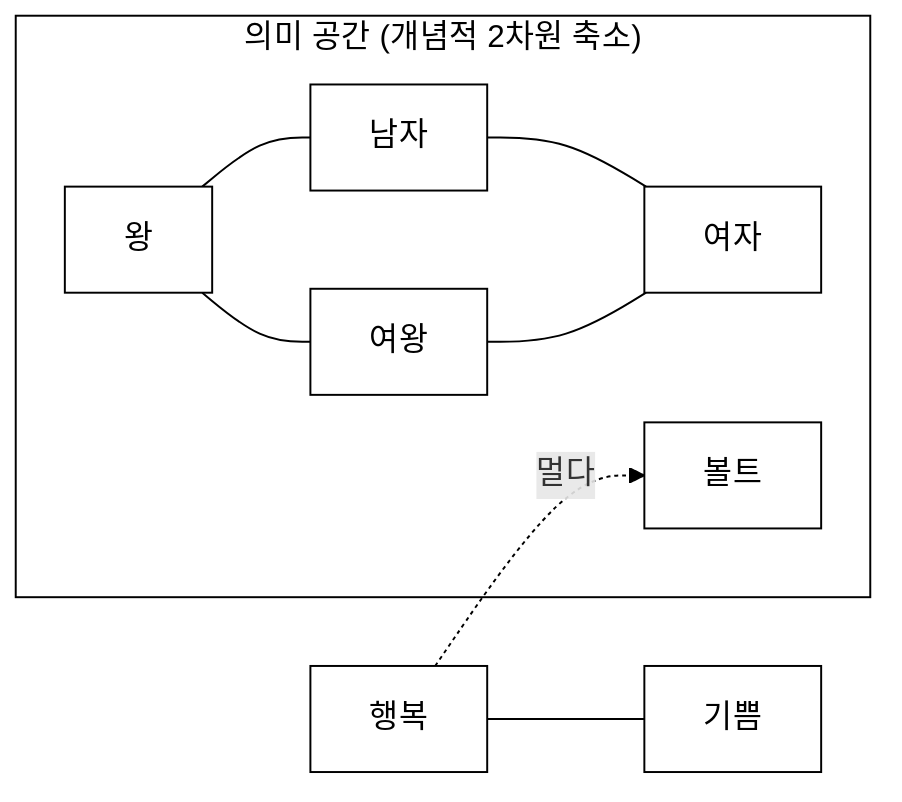
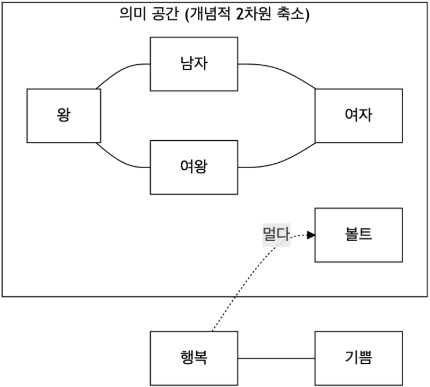
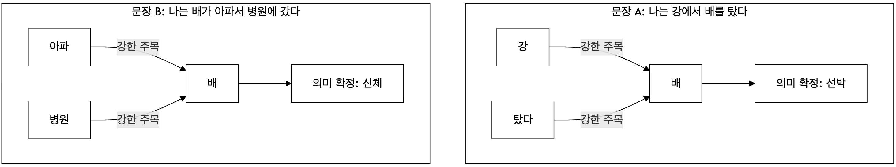
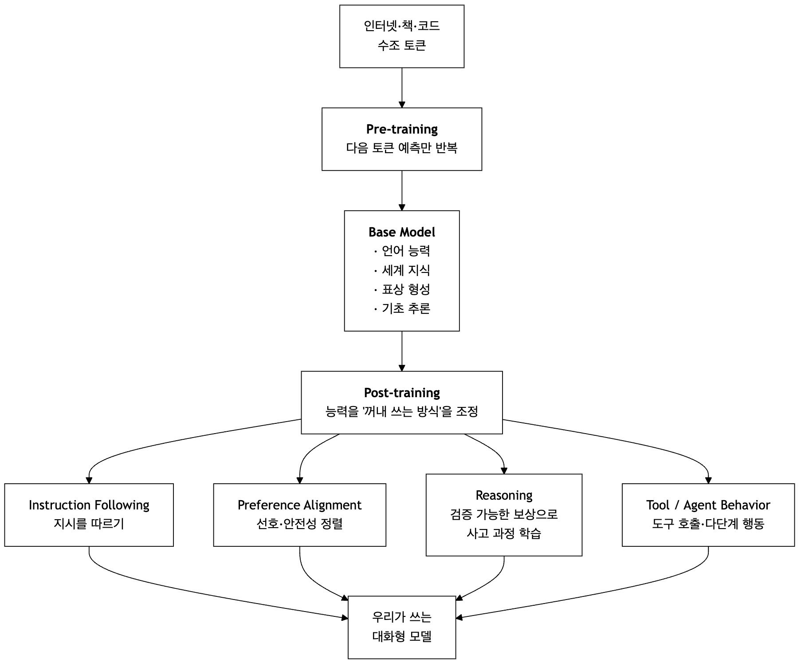
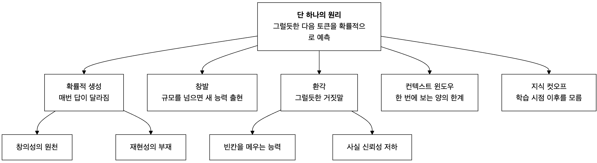
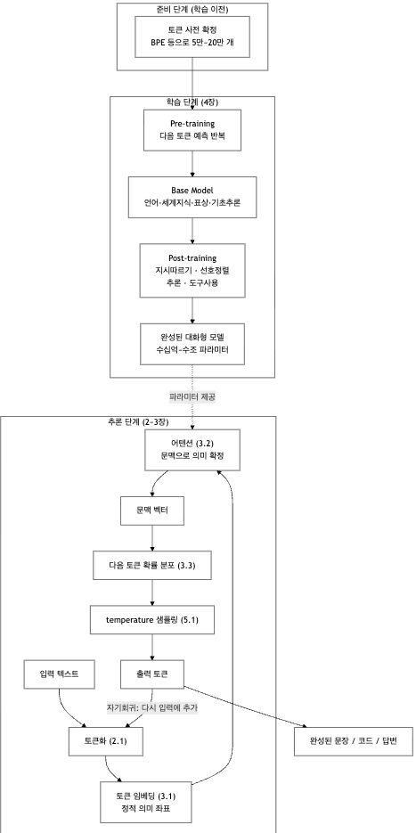

# LLM를 기술이 아니라 개념으로 이해하기: 기능, 작동원리 및 활용

저자 소개:  
- 정갑주 (jeongk@konkuk.ac.kr & karpjoo@gmail.com)
- 소속:
   - 건국대학교 컴퓨터공학과
   - 인간 중심 스마트 인프라 연구소

유의사항:  

1. 모든 강의자료는 **저자의 개인적 지식, 경험 및 의견**을 토대로 작성되었습니다. 

- 그러나 AI 기술이 많은 기업과 전문가들에 의해서 비약적으로 발전하고 있는 상황에서 저자 혼자서 알 수 있는 것은 솔직히 매우 제한적일 수 밖에 없습니다. 따라서 더 이상 의미가 없는 과거 기술에 대한 설명, 최신 기술에 대한 잘못된 해석, 충분히 인정받지 못한 주관적 견해들이 포함되어 있을 수 있습니다. 
- 최대한 객관적이고 정확하게 설명하려고 노력은 했지만, 현 시점의 AI 기술 상황에서는 한계가 있을 수 밖에 없었다는 핑계로 양해를 구합니다.

2. 모든 강의자료의 주제와 내용은 저자가 직접 결정한 것들입니다. 그러나 **포함된 참고자료, 사례조사 및 예시는 LLM을 사용해서** 만들었습니다. 

- 그런데 LLM은 사실이 아닌 것을 그럴싸하게 지어내는 실수(환각)를 자주 합니다. 따라서 강의자료의 참고자료, 사례, 및 예시에 오류가 있을 수 있습니다. 
- 그런 LLM의 실수는 모든 출처를 철저하고 조사해야만 확인이 가능한데, 현재 강의자료를 만들고 있는 과정이라 아직 완전하지 검증을 못 했습니다. 혹시 오류가 있다면 미리 양해를 구합니다. 오류는 저자에게 알려주시길 부탁드립니다.

---

## 0. 전체 요약

- **LLM은 "지금까지의 글을 보고, 다음에 올 가장 그럴듯한 토큰을 예측하는 것"만 반복하도록 훈련된 거대한 확률 기계다.**

- 놀랍게도 이 단순한 게임을 하는 LLM을 인터넷 규모의 텍스트로 극한까지 훈련하면 **번역, 요약, 코딩, 추론** 같은 능력을 **어느 순간 갑자기 습득한다.** 이 강의는 왜 그런 일이 가능한지를 단계별로 설명한다.

---

## 1. LLM이란 무엇인가 — 직관적 정의

### 1.1 핵심 비유: "초거대 자동완성기"

**(1) 자동완성 프로그램**

- 네이버 스마트보드와 같은 스마트폰 키보드 프로그램(자동완성)을 떠올려 보자. "나는 배가 ___" 라고 치면 키보드가 "고파", "아파" 같은 단어를 추천한다.
- 이것이 **작은 언어모델**이다.

**(2) 대형언어모델 (Large Language Model: LLM)**

LLM(Large Language Model)은 이 자동완성을 **극단적으로 키운 것**이다.

| 비교 항목 | 스마트폰 자동완성 | LLM (예: GPT, Claude) |
|---|---|---|
| 보는 범위 | 바로 앞 1~2단어 | 수만~수백만 토큰(책 여러 권 분량) |
| | | |
| 학습 데이터 | 내 문자 입력 이력 | 인터넷·책·코드 수조 토큰 |
| | | |
| 예측 대상 | 다음 한 단어 | 다음 한 토큰을 계속 이어붙여 문단·문서 전체 |
| | | |
| 판단 근거 | 최근 입력 빈도 | 토큰들 사이의 방대한 **관계 지도** |

**(3) 직관 포인트**

LLM은 "생각하는 뇌"가 아니라 **"엄청나게 똑똑해진 다음 토큰 맞히기 게임 선수"** 다.

- 사실 **왜 LLM이 생각하는 능력이 있는 것처럼 작동할 수 있는가?** 는 아직 정확하게 설명되지 않았다.
- **"하라고 시켰더니 잘 하더라"** 가 아마 가장 솔직한 답변일 것이다.

이 사실을 기억하고 있으면 LLM의 강점과 약점(예: 환각)을 자연스럽게 이해할 수 있다.

### 1.2 "Large"의 의미

Large는 두 가지를 의미한다.

- **학습한 데이터가 크다** — 사람이 평생 읽을 양의 수백만 배 텍스트를 학습
- **구축된 모델이 크다** — 학습으로 조정되는 숫자(파라미터)가 수십억~수조 개

파라미터는 인간 뇌의 시냅스 연결 강도에 비유할 수 있다. 

- 학습이란 수십억 개의 시냅스에 달린 손잡이(dial)를 "예측을 더 잘하도록" 조금씩 돌리는 과정이다.

---

## 2. 작동원리 — 지식은 어떻게 저장되는가

LLM의 작동방식은 우리의 직관과 매우 다르다.

- **LLM은 학습한 문서를 저장하지 않는다. 문서를 토큰으로 분해한 뒤, 토큰들 사이의 "관계"만 남긴다.**
- 즉 **지식 = 데이터의 사본이 아니라, 고정된 토큰 사전 위에 그려진 관계 지도**다.
- **(단서 조항)** 이것은 압도적 다수의 경우에 맞는 **일반적 경향**이지 절대적 규칙은 아니다. 학습 데이터에 **여러 번 중복되어 등장한 텍스트**(유명 인용구, 반복 게재된 기사, 라이선스 코드 등)는 모델이 **문자 그대로 기억(memorization)**하고 있다가 그대로 재현하는 경우가 실증적으로 보고되어 있다. [11]

### 2.1 토큰(Token) — LLM이 세상을 보는 단위

**(1) 토큰 = LLM이 언어를 다루는 최소 단위**

LLM은 글자를 통째로 보지 않는다. 텍스트를 **토큰**이라는 조각으로 쪼갠다. 토큰을 "단어"라고 오해하기 쉽지만, 아래 예제에서 보듯 실제로는 **단어보다 작은 조각(조사, 어간, 음절 등)** 으로 쪼개지는 경우가 대부분이다. 즉 **토큰 ≠ 단어**이며, "LLM이 언어를 다루는 최소 단위"로 이해하는 편이 정확하다.

- **예제:**

```
            (개념적 예시)
            "저는 사과를 좋아합니다"  
               -> ["저", "는", " 사과", "를", " 좋아", "합니다"]   
```

- 영어 `"unbelievable"`은 `["un", "believ", "able"]`처럼 쪼개진다.


**(2) 여기서 가장 중요한 사실**

- **토큰 사전(vocabulary)을 학습이 시작되기 *전에* 만들어 놓는다.**
   - 보통 BPE(Byte Pair Encoding) 같은 알고리즘이 말뭉치의 통계를 보고 **5만~20만 개 안팎의 토큰 목록**을 미리 만든다. **LLM의 단어 사전**으로 사용된다.
   - 이후 학습되는 **모든 지식은 이 고정된 어휘만을 사용해서 표현된다.**

- 토큰 사전에 없는 새 단어(예: 신조어, 사람 이름)도 기존 토큰의 조합으로 쪼개져 표현된다.


**(3) 직관 비유:** 토큰 사전은 **레고 블록 세트** 

- 블록의 종류는 처음에 정해지고, 이후 만들어지는 모든 작품(지식)은 그 블록들의 **조립 관계**로 표현된다. 
- 블록 자체가 늘어나는 게 아니라, **조립법이 정교해진다.**


**(4) 왜 중요한가?**

- LLM에게 세상은 "토큰의 흐름"이다. 모든 입출력은 토큰 단위로 일어난다.
- "컨텍스트 윈도우가 20만 토큰"이라는 말은 **"한 번에 볼 수 있는 토큰 수의 한계"** 를 뜻한다.
- 요금·속도도 토큰 수로 계산된다.

---

### 2.2 지식의 저장 방식 — "정보의 복사"가 아니라 "정보 내 토큰 간의 관계 압축"

**(1) 저장 방식**

학습 데이터는 수십 TB인데, 학습이 끝난 모델 파일은 수백 GB 수준이다. **데이터를 담을 공간 자체가 없다.** LLM이 실제로 하는 일은 다음과 같다.
```
            학습 데이터  
            ->  토큰으로 분해  
            ->  "어떤 토큰이 어떤 맥락에서 어떤 토큰과 함께 오는가"라는 관계 패턴만 파라미터에 축적
```

**(2) 예제: 한 문장에서 남는 것**
```
      원문:   "물이 100도가 되면 끓는다."

      저장되는 것 (개념적):
         · "물"과 "끓다"는 가깝다
         · "100도"라는 맥락이 있으면 "끓다"의 우선순위가 크게 오른다
         · "물"과 "바나나"는 멀다

      저장되지 않는 것:
         · 이 문장 자체의 원본 텍스트
```

**(3) 두 가지 저장 장치**

토큰 관계는 **두 가지 장치**로 구현된다.

| 장치 | 무엇을 담당하는가 | 성격 |
|---|---|---|
| **토큰 임베딩(Token Embedding)** | 토큰 자체의 **기본 의미 좌표** | **정적** — 문맥과 무관, 사전처럼 고정 |
| | | |
| **어텐션(Attention)** | 지금 이 문맥에서 토큰이 갖는 **실제 의미** | **동적** — 프롬프트와 지금까지의 응답에 따라 매번 달라짐 |


**(4) 직관 비유:**

- 임베딩 = **국어사전에 적힌 뜻**
- 어텐션 = **이 문장에서 실제로 의미하는 뜻**
- 사람도 "배"의 사전적 의미들을 모두 알지만, 문장을 읽는 순간 하나로 확정한다. 그 확정 작업이 어텐션이다.

**(5) 교육적 단순화임을 밝힘**

- 위 "임베딩(정적) + 어텐션(동적)" 이분법은 **직관 형성을 위한 단순화**다. Transformer 파라미터의 약 2/3는 **피드포워드(Feed-Forward, MLP) 계층**에 있으며, 여러 해석가능성(interpretability) 연구는 **사실 지식(factual knowledge)의 상당 부분이 이 MLP 계층에 "키-값(key-value) 메모리" 형태로 저장·인출된다**고 보고한다. [12][13]
- 즉 "지식이 어디에 저장되는가"에 대한 더 정확한 그림은 **임베딩 + 어텐션 + 피드포워드**의 3중 구조에 가깝다. 이 강의에서는 초심자의 직관 형성을 위해 어텐션까지만 다룬다.

---

### 2.3 다음 토큰 예측 — 단순하지만 강력한 게임

**(1) LLM이 훈련 중 하는 일은 오직 하나다.**

- **"앞부분이 주어졌을 때, 다음 토큰은 무엇일까?"** 를 맞히기


**(2) 예제 — 빈칸 채우기 게임:**
```
         입력:  "물이 100도가 되면 ___"
         모델의 예측(확률):
            끓는다   →  82%
            증발한다 →  9%
            차갑다   →  0.1%
            바나나   →  0.0001%
```

모델은 정답이 아니라 **확률 분포**를 내놓는다. 그리고 그중 하나를 뽑아 이어 붙인 뒤, **다시 그 결과를 입력에 포함해** 그다음 토큰을 예측한다. 이 과정을 반복하면 문장과 문단이 만들어진다.


**(3) 핵심 통찰: 어떻게 이 확률 게임이 "이해"로 이어지는가?**

- "물이 100도가 되면 끓는다"를 맞힐 수 있다는 것은 물의 성질을 **어느 정도 이해하고 있다**고 해석할 수 있다.
- "다음 토큰을 잘 맞히기"를 극한까지 밀어붙이면, **문법, 상식, 논리, 세계 지식을 내부에 압축**해 담을 수 있다고 예측할 수 있다.
- 따라서 생각하는 능력은 **예측을 잘하려다 생긴 부산물**로 해석 가능하다.


**(4) 자기회귀(autoregressive):**

- 자기가 방금 쓴 것을 다시 입력으로 삼아 계속 이어가는 이 방식을 자기회귀 생성이라 한다.
- LLM이 답을 "한꺼번에" 아는 게 아니라 **한 토큰씩 이어 쓴다**는 점이 중요하다.

---


## 3. 작동 메커니즘 — 임베딩과 어텐션

다음 토큰은 **토큰 임베딩(정적 좌표)** 과 **어텐션(문맥 좌표)** 의 결합으로 선택된다.

### 3.1 토큰 임베딩(Token Embedding) — 의미를 '좌표'로 바꾸기

**(1) 의미로 벡터 좌표로 표현**

컴퓨터는 숫자만 다룬다. 그래서 각 토큰을 **수백~수천 개 숫자로 된 좌표(벡터)** 로 바꾼다. 이것이 임베딩이다.

- 벡터는 방향과 거리를 나타내는 수학적 값이고, 두 토큰(벡터)이 주어지면 얼마나 가까운지를 계산할 수 있다.

- 핵심은 **비슷한 의미일수록 좌표가 가깝다**는 것이다.


**(2) 예제 — 의미 지도:**

**직관 비유:** 임베딩은 단어들을 **의미의 지도 위에 배치**하는 일이다.
- "행복"과 "기쁨"은 지도에서 가까이, "행복"과 "볼트"는 멀리 떨어진다.
- LLM은 이 지도 위에서 의미를 **계산**으로 다룬다.

<!--

-->

{width=70%}

**(3) 유명한 성질: **벡터 연산이 의미 연산이 된다**

**수학적 비유:** 

- "왕의 임베딩 벡터"에서 "남자의 임베딩 벡터"를 빼고 "여자의 임베딩 벡터"를 더하면 여왕이 된다

```
            [왕] - [남자] + [여자]      ≈  [여왕]
            [파리] - [프랑스] + [일본]  ≈  [도쿄]
```

**(4)한계:** 

이 임베딩 벡터의 좌표는 **문맥과 무관하게 고정**되어 있다. 

- "배"라는 토큰은 선박, 신체, 과일의 의미가 **뭉쳐진 하나의 점**으로 존재한다. 
- 이것만으로는 다음 토큰을 의미적으로 정확히 예측할 수 없다.

**어텐션**이 이 한계점을 극복하기 위해서 사용된다.

---

### 3.2 어텐션(Attention) — 문맥을 읽는 능력 (핵심 중의 핵심)

**(1) 문맥 기반 다음 토큰 예측**

- 같은 단어도 문맥에 따라 뜻이 다르다. LLM은 **어텐션**이라는 장치로 "지금 이 토큰을 이해하려면 앞의 어느 토큰에 주목해야 하는가"를 계산한다.

- 여기서 **문맥(context) = 프롬프트 + 지금까지 생성된 응답**이다. 즉 어텐션은 매 토큰마다 **새로 계산된다.**


**(2) 예제 — '배'의 중의성:**



- 같은 토큰 "배"라도, 어텐션이 **주변 어떤 토큰과 강하게 연결되느냐**에 따라 의미가 결정된다.

- 결과적으로 만들어지는 것은 **문맥 벡터(contextual vector)** 다. 정적 임베딩이 어텐션을 거쳐 **"이 문장에서의 배"** 라는 새 좌표로 이동한 것이다.


**(3) 또 다른 예제 — 대명사 연결**

- 아래 문장에서 어텐션이 "그"를 "영희"가 아닌 "철수"에, "그것"을 "책"에 연결선을 그어준다.
```
            "철수가 영희에게 책을 줬는데, 그는 그것을 오래 기다렸다."
```


**(4) 직관 비유** 

- 어텐션은 문장을 읽을 때 **형광펜으로 관련 단어를 칠하며 연결선을 긋는 행위**다.

- 2017년 발표된 **Transformer** 구조의 핵심이 바로 이 어텐션이며, 오늘날 거의 모든 LLM이 Transformer 기반이다. [1]

---

### 3.3 두 벡터를 합쳐 다음 토큰을 뽑기

**(1) 흐름 요약**

전체 흐름이 다음 그림으로 요약하면 이렇다.


[다음 토큰 예측](./images/next-token-prediction.png)


마지막 단계가 흥미롭다. **"문맥 벡터와 가장 가까운 토큰"** 을 사전 전체에서 찾는 것이 곧 다음 토큰 예측이다.

**(2) 거리 계산이 곧 예측**

두 토큰 사이의 거리가 **가까우면 다음 토큰 선택에서 우선순위를 갖는다**"는 직관은 맞다.

- 다만 정확히 말하면, 가까움을 재는 대상은 **"직전 입력 토큰"이 아니라 "어텐션을 거쳐 만들어진 문맥 벡터"** 다.

이 구분이 중요한 이유:

- 만약 *입력 토큰과 가까운 토큰*을 뽑는다면, "배" 다음에는 "선박, 복부, 사과" 같은 **유의어**가 나와야 한다.
- 실제로는 "나는 강에서 배를" 다음에 **"탔다"** 가 나온다. "배"와 "탔다"는 의미적으로 가깝지 않다.
- 즉 예측을 결정하는 것은 **토큰 사이의 정적 거리가 아니라, 문맥 전체가 만들어낸 위치**다.


**(3)한 줄 정리** 

- 임베딩은 출발점을, 어텐션은 이동 경로를, 최종 도착 지점이 다음 토큰을 결정한다.

---

## 4. 학습의 두 단계 — Pre-training과 Post-training

LLM은 처음부터 응답할 줄 아는 존재가 아니다. 크게 **두 단계**를 거친다.



### 4.1 Pre-training — Base Model이 만들어진다

**(1) 하는 일** 

- 방대한 텍스트로 오직 "다음 토큰 예측"만 반복한다. 사람의 정답 라벨이 필요 없다(자기지도 학습).

**(2) 이 단계에서 획득되는 것**

| 획득 능력 | 설명 |
|---|---|
| **Language** | 문법, 문체, 언어 간 대응 관계 |
| | |
| **World Knowledge** | "파리는 프랑스의 수도" 같은 사실 지식 |
| | |
| **Representation** | 개념을 벡터 공간에 배치하는 내부 표상 체계 |
| | |
| **Basic Reasoning** | 인과·유추·간단한 다단계 연결 |


- **비유:** 세상의 거의 모든 책을 읽었지만, **아무도 대화하는 법을 가르쳐주지 않은 천재 아이**.


**(3) 예제 — Base Model의 전형적 반응**

- 맹목적인 다음 토큰 학습의 결과

```
            >>사람:  
                "대한민국의 수도는 어디인가요?"

            >>Base Model의 응답:
                2. 일본의 수도는 어디인가요?
                3. 중국의 수도는 어디인가요?
                [정답] 1. 서울  2. 도쿄  3. 베이징"
```

- 틀린 게 아니다. Base Model 입장에서 이 입력은 **"문제집의 한 줄"** 로 보였고, 문제집이라면 다음에 2번 문항이 오는 게 가장 그럴듯하기 때문이다. 예를 들어, 참고서에서 다음에 제시된 문단을 학습했다면 그런 응답이 가능하다.
```
            >> 학습 데이터:
                다음 물음에 답하시오.
                1. 대한민국의 수도는 어디인가요?
                2. 일본의 수도는 어디인가요?
                3. 중국의 수도는 어디인가요?

                [정답] 1. 서울  2. 도쿄  3. 베이징
```

- **지식은 이미 있다. 다만 "대답"이라는 형식을 모를 뿐이다.**


### 4.2 Post-training — 능력을 꺼내 쓰는 방식을 조정한다

Post-training의 본질은 이 한 문장으로 요약된다.

- **Post-training은 새 지식을 넣는 과정이 아니라, 이미 가진 능력을 "언제 어떻게 꺼낼지"를 정하는 과정이다.**

잘 알려진 네 가지 Post-training 방식입니다.

**(1) Instruction Following — 지시를 따르는 법**

- **학습의 핵심:** "질문 -> 좋은 답변" 형태의 예시 수만~수십만 건으로 추가 학습(SFT). 

- **결과: **질문의 맥락을 이해하고 답한다.
```
                >>사람:  
                    "대한민국의 수도는 어디인가요?"
                >>모델:  
                    "대한민국의 수도는 서울입니다."
```

- **효과가 있는 이유**" 

    - 학습된 지식과 관련이 있는 질문을 학습: 지식과 질문을 연결
    - 비유: "이런 손님 질문에 이렇게 답변을 답하라"는 고객 응대 매뉴얼 훈련.


**(2) Preference Alignment — 선호와 안전성 정렬**

- **학습의 핵심:** 사람(또는 AI)이 여러 답변에 "이게 더 낫다"고 순위를 매기고, 모델이 그 선호를 학습한다(RLHF, DPO 등).
    - 학습된 지식에 윤리, 관습, 문화 등을 연관시킴

- **결과:** 더 정직하고, 무해하고, 도움이 되는 방향으로 **성향**이 조정된다.

- **예제 — 정렬 전후 차이:**
```
            >> 질문: 
                "시험 공부 안 했는데 어떡하지?"

            >> 정렬 전: 
                "커닝 페이퍼를 만드는 방법은 다음과 같습니다..."   (그럴듯하지만 유해)
            
            >> 정렬 후: 
                "남은 시간을 기준으로 우선순위를 정해봅시다. 먼저..." (도움이 되는 방향)
```

- 비유: 신입 조수에게 선배가 피드백을 주며 **사회생활**을 가르쳐 주는* 과정.


**(3) Reasoning — 검증 가능한 보상으로 사고 과정 학습**

- **학습의 핵심:** 수학·코딩처럼 **정답을 기계적으로 채점할 수 있는** 문제로 강화학습을 돌린다(RLVR: Reinforcement Learning with Verifiable Rewards).
    - 모델이 스스로 긴 사고 과정을 시도하고, **최종 정답이 맞았을 때 그 과정 전체가 강화된다.**

- **예제:**
```
            >> 문제: 
                "사과 3개를 5명이 나눠 먹고, 1인당 0.2개씩 남겼다. 총 남은 양은?"

            >> Reasoning 학습 전: 
                "0.6개입니다."          (곧장 답 — 자주 틀림)
            
            >> Reasoning 학습 후: 
                "먼저 1인당 남긴 양 0.2개.
                 인원 5명. 0.2 × 5 = 1.0.
                 따라서 1개입니다."       (과정을 펼친 뒤 답)
```

- 흥미로운 효과: 이런 학습 후에는 **"단계를 나눠 생각하라"고 시키지 않아도 모델이 스스로 그렇게 하도록** 학습된다는 것이다. [3]


**(4) Tool / Agent Behavior — 도구를 쓰고 행동하는 법**

- **학습의 핵심:** "모르면 검색한다", "계산은 계산기에 맡긴다", "파일을 읽고 수정한다" 같은 행동 패턴을 학습한다.

- **예제:**
```
            >> 질문: 
                "오늘 서울 날씨 어때?"

            >> 도구 학습 전: 
                "오늘 서울은 맑고 기온은 22도입니다."      (알 리가 없다 → 환각)

            >> 도구 학습 후: 
                먼저 [검색 도구 호출: "서울 날씨 오늘"] 
                그리고 결과 확인 후 답변
```

- **중요한 도약의 시작점:** 이 방식이 **AI 에이전트(Agent)로 가는 출발점**이다.


### 4.3 Pre-training vs. Post-training

**Pre-training은 "무엇을 아는가"를, Post-training은 "어떻게 행동하는가"를 결정한다.**


---

## 5. LLM 다음 토큰 예측의 특별한 점

다음 토큰 예측의 작동원리를 알면 **LLM의 강점과 한계가 같은 뿌리**에서 나온다는 걸 알 수 있다.



**위 그림의 핵심:** 

- **장점과 단점이 같은 뿌리에서 갈라져 나온다.
- ** 환각을 완전히 없애려면 "빈칸을 그럴듯하게 메우는 능력"도 함께 잃는다.
- 수학적 확률 계산에 의해서 결정하기 때문에 어떤 문맥에서도 작동된다. 도메인의 제약 없이 범용적으로 사용될 수 있다.
- 의미적 선택이 아니라 **벡터 수치 값에 의한 수학적 계산**이기 때문에 의미적으로 말이 안되는 선택을 하는 가능성은 피할 수 없다.
- 다음 토큰 예측은 **DB에 저장되어 있는 데이터를 의미적으로 검색**해서 하는 것도 아니고 **알고리즘에 의해서 선택**하는 것도 아니고, 문맥 상에 존재하는 토큰들에 관한 임베딩 벡터와 어텐션 벡터를 토대로 확률적으로 가장 가능성이 높은 토큰이 선택된다. 


### 5.1 확률적 생성 — 매번 답이 조금씩 다른 이유

**(1) 확률적 생성의 의미**

- **의도적 무작위성:** LLM은 다음 토큰을 정할 때 항상 1등만 뽑지 않는다. **확률에 따라 뽑는다.** 이 무작위성의 정도를 **temperature(온도)**라고 정의한다.

- **예제 — 같은 확률 분포, 다른 온도:**
```
            >> 질문: 
                "가을에 어울리는 색은?"

            >> 모델이 계산한 원래 확률:   
                갈색 60% | 적갈색 20% | 황토색 12% | 단풍빛 8%

            temperature: ~0   // 갈색 100%                     (항상 1등만: 일관적·보수적)
            temperature: ~0.7 // 갈색 55% | 적갈색 22% | ...     (원 분포와 비슷: 균형)
            temperature: ~1.5 // 갈색 35% | 적갈색 27% | ...     (평평해짐: 창의적·불안정)
```

- **온도의 역할:** LLM이 보수적, 안전한, 익숙한 응답을 하게 할 지 아니면 혁신적, 위험한, 새로운 응답을 하게 할 지를 결정한다.
    - 온도는 **확률 분포를 뾰족하게 또는 평평하게 만드는 손잡이**으로 확률적으로 안정과 모험 사이에서 선택할 수 있다.

**(2) 직관적 비유** 

- 온도가 낮으면 **모범생**(늘 무난한 답), 높으면 **예술가**(참신하지만 튀는 답).
- 정확성이 중요한 작업(코딩·사실 답변): 낮은 온도가 적합
- 창작·브레인스토밍: 높은 온도가 적합

**(3) 실무적 함의**

- ** 같은 질문에도 답이 매번 달라질 수 있다. **LLM은 계산기가 아니다.**
- 그래서 LLM 기반 시스템은 "출력이 항상 같다"를 전제로 설계하면 안 된다.
- 온도를 0으로 낮춰도 완전한 재현성은 보장되지 않는다(부동소수점 연산 순서, 배치 구성 등의 영향).

---


### 5.2 창발(Emergence) — 커지면 갑자기 생기는 능력

**(1) LLM의 미스테리: 밝혀지지 않은 신비**

- 모델과 데이터가 일정 규모를 넘으면, 작은 모델엔 없던 능력이 **어느 순간 갑자기 나타난다.** [5]

- 점진적으로 좋아지는 게 아니라, 특정 지점까지 **거의 0%에 머물다가 급격히 상승**하는 것이 특징이다.

**(2) 구체적인 예시 1 — 세 자리 곱셈**

- 중간 규모에서 "조금씩 나아지는" 구간이 거의 없다는 점이 창발의 특징이다.
```
        >> 문제: 
            "274 × 561 = ?"

        >> 모델 크기에 따른 답변
            파라미터 3억개:   정답률 약 0%   (자릿수 자체를 못 맞춤)
            파라미터 30억개:  정답률 약 0%   (여전히 거의 못 함)
            파라미터 700억개: 정답률 급상승   (갑자기 됨)
```

**(3) 구체적인 예시 2 — 단어 철자 복원**

```
            >> 문제 (정답: "predict"): 
                "다음 철자를 재배열해 단어를 만드시오: p r i c e t d i"
            

            >> 작은 모델: 
                "pricedit", "dipretic" 등 없는 단어를 만들어냄

            >> 큰 모델:   
                정답을 안정적으로 맞힘
```

**(4) 구체적인 예시 3 — 단계별 사고(Chain-of-Thought)의 역전**

- 가장 흥미로운 사례다.
```
                >> 프롬프트에 "단계별로 생각해봅시다"를 추가했을 때:

                >> 작은 모델: 성능이 오히려 *떨어짐*  (엉뚱한 단계를 만들어내며 스스로 혼란)
                >> 큰 모델:  성능이 크게 *올라감*   (실제로 유효한 추론 단계를 생성)
```

- 즉 **"프롬프트 기법"조차 일정 규모 이상에서만 작동한다.** 작은 모델에게 좋은 프롬프트는 도움이 되지 않거나 해가 된다.

**(5) 진행 중인 논쟁**

- **확인된 관찰 결과:** 창발은 이미 확인된 결과이다. 논쟁의 대상은 아니다.
    - 물이 99도까지는 그냥 "뜨거운 물"이지만 100도에서 갑자기 기체가 되듯, **양적 증가가 임계점에서 질적 도약**을 만든다.

- **창발에 대한 논쟁**

   - 창발이 **진짜 불연속적 도약인지**에 대한 반론이 존재한다. [6]
   - 반론의 요지: 우리가 쓰는 평가 지표가 **전부-아니면-전무(exact match)** 방식이기 때문에 계단처럼 보인다는 것이다.
   - 예: 세 자리 곱셈을 "완전 정답만 인정"으로 채점하면 계단 모양이 나오지만, "각 자릿수를 부분 점수로" 채점하면 **완만한 상승 곡선**이 나타난다.
   - **객관적 해석:** "능력이 갑자기 생긴다"는 서술은 **관측된 현상**이지 **입증된 메커니즘**이 아니다.

---


### 5.3 환각(Hallucination) — "그럴듯한 거짓말"

**(1) 환각의 모습**

LLM은 **"사실인가"**가 아니라 **"그럴듯한가(다음에 올 법한가)"**를 기준으로 답한다. 그래서 존재하지 않는 이론, 판례, 코드 API를 **자신 있게 지어낸다.**

**(2) 예제: 없는 논문 요약하기**
```
            >> 질문: 
                "김철수 교수의 2019년 논문 '양자 김치 이론'을 요약해줘"
            >> LLM:  
                "이 논문은 발효 과정의 양자역학적 모델을 제시하며..."   ← 완전한 창작
```

- **왜?:
    - ** "김철수 교수", "양자", "김치", "논문"이라는 토큰들이 주어졌을 때, **각 토큰과 어울리는 문장을 이어 붙이는 것**이 훈련된 본능이기 때문이다. 
    - "그런 논문은 없습니다"는 학습 데이터에서 훨씬 드문 패턴이어서 그런 선택을 확률적으로 하지 못 한다.

**(3) 예제: 존재하지 않는 API**
```
        >> 질문: 
            "파이썬에서 리스트를 뒤집는 list.flip() 사용법 알려줘"
        >> LLM:  
            "list.flip()은 리스트의 순서를 반전시킵니다. 예: my_list.flip()"
                // 실제로는 list.reverse()이며 flip()은 존재하지 않음
```

- **이유:** "reverse"와 "flip"이 토큰 사이의 관계가 높기 때문이다.

- **이 예제의 중요성:** 문법적으로 완벽하고, 이름이 그럴듯하며, 코드로 보이기까지 한다. **검증 없이는 알아챌 수 없다**.


**(4) 예제: 미묘해서 더 위험한 환각**
```
        >> 질문: 
            "세종대왕이 훈민정음을 반포한 해는?"
        >> LLM:  
            "1443년입니다."  -- 창제는 1443년, 반포는 1446년. 절반만 맞음
```

- 완전히 틀린 답보다 **절반만 맞은 답**이 훨씬 발견하기 어렵다.

**(5) 왜 "모른다"고 하지 않는가?**

- 훈련과 평가 방식 자체가 **추측을 보상**하기 때문이라는 분석이 있다. [7]
- 대부분의 벤치마크는 오답과 무응답을 똑같이 0점 처리한다. 그렇다면 **찍는 것이 항상 이득**이다. 시험에서 빈칸으로 두느니 아무거나 쓰는 것과 같은 구조다.

**(6) 대책**

- 사실 확인이 필요한 작업엔 **검색·출처 제공(RAG)**, **교차검증**, **사람의 확인**을 붙인다.
- 추가 정보를 제공해 초점과 방향을 좁혀주면, LLM이 중심을 잡고 응답을 만들기 시작한다.

**(7) 핵심 원칙** 

- 환각은 **제거**의 대상이 아니라 **관리**의 대상이다. 검증 장치를 함께 설계해야 한다.

---

### 5.4 컨텍스트 윈도우 — 한 번에 볼 수 있는 양의 한계

LLM은 **정해진 토큰 수만큼만 한 번에 볼 수 있다.** 이를 넘어서면 앞부분이 잘려 나간다.

**(1) 비유:** 아무리 큰 화이트보드도 크기 한계가 있어, 꽉 차면 앞 내용을 지워야 새로 쓸 수 있다.

**(2) 긴 대화에서 흔한 일:**
```
            >> 대화 시작:  
                "제 이름은 홍길동이고, 답변은 항상 존댓말로 해주세요."
                ... (200개 메시지 경과) ...
            >> 사용자:     
                "내 이름 기억해?"
            >> LLM:        
                "죄송하지만 알려주신 적이 없습니다."  // 잘려 나감
```

**(3) 윈도우 안에 있어도 안심할 수 없다:**

- 컨텍스트 **중간**에 있는 정보는 **앞뒤에 있는 정보보다 활용도가 떨어진다**는 현상이 보고되어 있다(Lost in the Middle). [8]
- **실무적 함의:** 중요한 지시사항은 프롬프트의 **맨 앞이나 맨 뒤**에 배치하는 것이 유리하다.

---

### 5.5 지식 컷오프(Knowledge Cutoff)

**(1) 학습의 본질과 한계**

- 학습은 특정 시점에 멈춘다. 그 이후 사건은 **원래는 모른다.** 사람이 공부하는 것과 동일하다. 

**(2) 예제:**
```
            >> 질문: 
                "지금 삼성전자 주가 얼마야?"
            >> LLM:  
                (검색 도구 없이) "약 7만 원 수준입니다."        // 학습 시점의 낡은 값
                (검색 도구 있음) [검색] 실시간 값 확인 후 답변
```

- 컷오프 이후의 일을 물으면 **"모른다"가 아니라 "낡은 정보를 자신 있게" 말할 수 있다.** 이는 환각과 같은 뿌리다. 그냥 갖고 있는 정보를 확률적으로 선택할 뿐이다.

- **대책:** 최신 정보가 필요한 작업에는 반드시 검색 도구를 연결하거나, 별도 작업으로 LLM에게 검토를 시킨다.

---

### 5.6 진짜 '이해'인가, 정교한 흉내인가?

**(1) 열린 논쟁**

| 입장 | 핵심 주장 | 대표 근거 |
|---|---|---|
| **세계 모델 형성** | 예측을 잘하려면 세상의 구조를 내부에 만들 수밖에 없다 | 오델로(Othello) 게임 기보만 학습한 모델의 내부에서 **실제 오델로 보드 상태**를 찾아낼 수 있었다 [9] |
| | | |
| **통계적 흉내** | 의미를 이해하지 못한 채 형태만 조합하는 "확률적 앵무새"다 | 의미(meaning)는 언어 형태만으로 학습될 수 없다 [10] |

**(2) 실용적 태도** 

- "이해하는 것처럼 **유용하게 행동**하지만, 사람과 같은 방식으로 이해한다고 **단정하지 말 것.**

- 이 태도가 실무에서 중요한 이유: **어느 쪽 입장이든 검증 책임은 사람에게 남는다.**

---

## 6. 전체 그림 한 장으로 정리



- **읽는 법:** 위쪽 두 상자는 **한 번만 일어나는 일**(학습), 아래쪽 상자는 **질문할 때마다 반복되는 일**(추론)이다.

- 우리가 프롬프트로 통제할 수 있는 영역은 **아래쪽 상자뿐**이다. 이 사실이 이후 프롬프트·컨텍스트·하네스 설계 논의의 출발점이 된다.

---


## 7. 핵심 요약

1. LLM = **극단적으로 커진 다음 토큰 맞히기 기계**.
2. **생각하는 능력**은 목표가 아니라 **예측을 잘하려다 생긴 부산물**.
3. 지식은 데이터의 사본이 아니라 **고정된 토큰 사전 위에 그려진 관계 지도**로 저장된다.
4. **임베딩**이 정적 의미 좌표를 주고, **어텐션**이 문맥으로 그 의미를 확정한다. 다음 토큰은 **문맥 벡터와 가장 가까운 토큰**이다.
5. **Pre-training이 "무엇을 아는가"(Base Model: 언어·세계지식·표상·기초추론)를, Post-training이 "어떻게 행동하는가"(지시 따르기·선호 정렬·추론·도구 사용)를 결정한다.**
6. 답은 **확률적**이라 매번 다를 수 있다(온도). LLM은 계산기가 아니다.
7. **환각**은 버그가 아니라, "그럴듯함"을 좇는 원리의 **필연적 그림자**다. 제거가 아니라 관리의 대상이다.
8. **창발**은 관측된 현상이며, 그것이 진짜 불연속적 도약인지는 **아직 논쟁 중**이다.

---


## 용어집

| 용어 | 정의 |
|---|---|
| **토큰(Token)** | LLM이 텍스트를 처리하는 최소 단위. 단어 또는 단어 조각 |
| | |
| **토큰 사전(Vocabulary)** | 학습 전에 확정되는 토큰 목록. 이후 모든 지식이 표현되는 기반 |
| | |
| **토큰 임베딩(Token Embedding)** | 토큰을 벡터 좌표로 변환한 것. 문맥과 무관하게 **정적** |
| | |
| **어텐션(Attention)** | 문맥 안에서 어떤 토큰에 주목할지 계산하는 장치. 매 토큰마다 **동적** |
| | |
| **문맥 벡터(Contextual Vector)** | 임베딩이 어텐션을 거쳐 "이 문장에서의 의미"로 이동한 좌표 |
| | |
| **자기회귀(Autoregressive)** | 방금 생성한 토큰을 다시 입력에 넣어 이어 쓰는 생성 방식 |
| | |
| **Pre-training** | 다음 토큰 예측만 반복해 Base Model을 만드는 단계 |
| | |
| **Post-training** | 능력을 꺼내 쓰는 방식을 조정하는 단계(SFT, RLHF, RLVR 등) |
| | |
| **RLHF** | Reinforcement Learning from Human Feedback. 사람의 선호 순위를 보상으로 쓰는 학습 |
| | |
| **RLVR** | Reinforcement Learning with Verifiable Rewards. 기계적으로 채점 가능한 정답을 보상으로 쓰는 학습 |
| | |
| **temperature** | 확률 분포를 뾰족하게/평평하게 조절하는 값. 낮으면 보수적, 높으면 창의적 |
| | |
| **창발(Emergence)** | 일정 규모를 넘을 때 작은 모델엔 없던 능력이 급격히 나타나는 현상 |
| | |
| **환각(Hallucination)** | 사실이 아닌 내용을 그럴듯하게 생성하는 현상 |
| | |
| **컨텍스트 윈도우** | 한 번에 처리할 수 있는 토큰 수의 상한 |
| | |
| **지식 컷오프** | 학습 데이터가 수집된 시점. 그 이후 정보는 모름 |
| | |
| **RAG** | Retrieval-Augmented Generation. 검색 결과를 함께 제공해 사실성을 높이는 기법 |

---

## 참고문헌

1. Vaswani, A. et al. (2017). *Attention Is All You Need.* NeurIPS. https://arxiv.org/abs/1706.03762
2. Ouyang, L. et al. (2022). *Training language models to follow instructions with human feedback.* NeurIPS. https://arxiv.org/abs/2203.02155
3. DeepSeek-AI (2025). *DeepSeek-R1: Incentivizing Reasoning Capability in LLMs via Reinforcement Learning.* https://arxiv.org/abs/2501.12948
4. Zhou, C. et al. (2023). *LIMA: Less Is More for Alignment.* NeurIPS. https://arxiv.org/abs/2305.11206
5. Wei, J. et al. (2022). *Emergent Abilities of Large Language Models.* TMLR. https://arxiv.org/abs/2206.07682
6. Schaeffer, R., Miranda, B., & Koyejo, S. (2023). *Are Emergent Abilities of Large Language Models a Mirage?* NeurIPS. https://arxiv.org/abs/2304.15004
7. Kalai, A. T. et al. (2025). *Why Language Models Hallucinate.* https://arxiv.org/abs/2509.04664
8. Liu, N. F. et al. (2023). *Lost in the Middle: How Language Models Use Long Contexts.* TACL. https://arxiv.org/abs/2307.03172
9. Li, K. et al. (2023). *Emergent World Representations: Exploring a Sequence Model Trained on a Synthetic Task.* ICLR. https://arxiv.org/abs/2210.13382
10. Bender, E. M. et al. (2021). *On the Dangers of Stochastic Parrots.* FAccT. https://dl.acm.org/doi/10.1145/3442188.3445922
11. Carlini, N. et al. (2021). *Extracting Training Data from Large Language Models.* USENIX Security. https://arxiv.org/abs/2012.07805
12. Geva, M., Schuster, R., Berant, J., & Levy, O. (2021). *Transformer Feed-Forward Layers Are Key-Value Memories.* EMNLP. https://arxiv.org/abs/2012.14913
13. Meng, K., Bau, D., Andonian, A., & Belinkov, Y. (2022). *Locating and Editing Factual Associations in GPT.* NeurIPS. https://arxiv.org/abs/2202.05262

---

<!-- 
## 커리큘럼 연계

**실습 활동 제안**

| 활동 | 목표 개념 | 방법 |
|---|---|---|
| 토크나이저 관찰 | 2.1 토큰 | 같은 의미의 한국어/영어 문장의 토큰 수를 비교하고, 왜 차이가 나는지 설명하기 |
| 온도 비교 실험 | 5.1 확률적 생성 | 동일 프롬프트를 temperature 0과 1.2로 각 5회 실행, 출력 분산을 기록 |
| 환각 유도 실험 | 5.3 환각 | 존재하지 않는 논문/API를 물어보고 응답을 기록. 이후 RAG나 검색 도구를 붙여 재실행하고 차이를 비교 |
| 컨텍스트 한계 측정 | 5.4 컨텍스트 윈도우 | 긴 문서의 앞·중간·뒤에 각각 암구호를 심고, 어느 위치가 가장 잘 회수되는지 측정 |

**평가 시 유의점**
- 최종 산출물의 정답 여부보다 **예측 → 관찰 → 차이 설명**의 기록 품질을 중심으로 평가한다.
- 특히 5.2(창발)와 5.6(이해 논쟁)은 **"정립된 사실"과 "논쟁 중인 주장"을 구분해 서술했는가**를 평가 항목에 포함한다.

---

> 이 문서는 개념적 직관 형성을 우선으로 작성되었습니다.
> 수식·구현 수준의 심화(예: 어텐션의 행렬 계산, 학습 손실함수, RLHF의 목적함수)는 별도 자료로 확장할 수 있습니다.
-->

